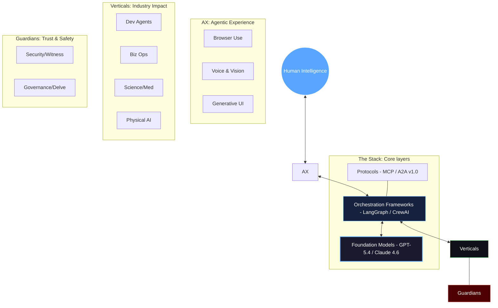

<div align="center">


<br/>

[](https://git.io/typing-svg)

<br/>

[](https://awesome.re)&nbsp;
[](https://opensource.org/licenses/MIT)&nbsp;
[](http://makeapullrequest.com)&nbsp;
[](#)&nbsp;
[](#)&nbsp;
[](#)

</div>

---

<div align="center">

## 🌌 The Agentic Universe 2026



</div>

---

<div align="center">

## 🧭 Expedition Compass

| [🚀 The Stack](#-the-agentic-stack) | [🌐 Experience](#-the-agentic-experience-ax) | [💼 Verticals](#-vertical-industry-agents) | [🛡️ Guardians](#-guardians-security--governance) |
|:---:|:---:|:---:|:---:|
| Models, Frameworks, Protocols | Browser, Voice, Computer Use | Coding, Finance, Science, Robots | Security, Compliance, Alignment |

| [🛠️ Operations](#-agent-operations-ops) | [📈 Market Pulse](#-market-pulse--intel) | [🎓 Knowledge](#-knowledge-hub) | [🤝 Community](#-join-the-vanguard) |
|:---:|:---:|:---:|:---:|
| Workflow, Economy, Payments | Star Rankings, Q1/Q2 Trends | 2025 Review, 2027 Outlook | Contributing, Updates |

</div>

---

## 📈 Market Pulse & Intel

### 🔥 The Heatmap (April 2026)
> Top signals from the bleeding edge of autonomy.

```text
  Signal                 Momentum        Primary Trend
  ----------------------------------------------------------------------
  Claude Code            9.8/10         The IDE is now an Agent
  Agentic Security       9.5/10         $500M+ venture flow in Q1
  Physical Reasoning     9.2/10         VLA Models (NVIDIA Alpamayo)
  Inter-Agent Comms      8.9/10         A2A Protocol v1.0 Standard
  Agentic Commerce       8.5/10         UCP-enabled autonomous buys
```

### 🏆 The Titans (By GitHub Stars)
```text
  AutoGPT           ██████████████████████████████████████████████████ 170k+
  LangChain         ██████████████████████████████████████████████    105k+
  Open Interpreter  ██████████████████████████████████                58k+
  Cline / Roo Code  ████████████████████████████████                  55k+
  CrewAI            ████████████████████████████                      35k+
  LangGraph         ██████████████████                                17k+
```

---

## 🚀 The Agentic Stack
*The infrastructure layer powering the autonomous world.*

### 🧠 Intelligence (Frontier Models)
- **[GPT-5.4 Family](https://openai.com)** `🔥 Proprietary` — Adaptive thinking (Thinking/mini/nano); 2M context; GPT-4o deprecated.
- **[Claude 4.6 (Opus/Sonnet)](https://claude.ai)** `🔥 Proprietary` — SWE-bench king (82%+); native parallel agent orchestration.
- **[Gemini 3.1 Ultra](https://gemini.google.com)** `🆕 Proprietary` — Deep integration with Google Workspace & Physical Robot controllers.
- **[DeepSeek-R5](https://github.com/deepseek-ai)** `Open Source` — The Moore's Law of reasoning; massive performance-to-cost disruption.
- **[Llama 4.5 Agentic](https://llama.meta.com)** `Open Weights` — Fine-tuned specifically for tool-calling and long-horizon planning.

### 🚀 Orchestration (Frameworks)
- **[LangGraph](https://github.com/langchain-ai/langgraph)** `🔥 MIT` — The industry standard for stateful, cyclic agent graphs.
- **[CrewAI](https://github.com/joaomdmoura/crewAI)** `MIT` — Role-based multi-agent collaboration with built-in process management.
- **[Microsoft AutoGen 2.0](https://github.com/microsoft/autogen)** `Apache 2.0` — Re-architected for high-concurrency commercial deployments.
- **[OpenAI Agents SDK](https://github.com/openai/agents-sdk)** `MIT` — Minimalist, high-performance SDK for the GPT-5 ecosystem.
- **[Claude Agent SDK](https://docs.anthropic.com)** `🆕 MIT` — Focused on accuracy, sandboxing, and MCP native integration.
- **[Phidata](https://github.com/phidatahq/phidata)** `MIT` — High-speed tool-interfacing with persistent memory.

### 🛣️ Connectivity (Protocols & Standards)
- **[Model Context Protocol (MCP)](https://modelcontextprotocol.io)** `🔥 Anthropic` — The universal "USB-C" for connecting any AI to any data source.
- **[Agent2Agent (A2A) v1.0](https://developers.google.com)** `🆕 Google` — Cross-platform protocol for agents to negotiate and swap data.
- **[Universal Commerce Protocol (UCP)](https://developers.google.com/shopping)** `Google` — Standard for agents representing buyers/sellers in digital markets.
- **[Agent Grid UI (AG-UI)](https://github.com)** `Open Standard` — Unified schema for how agents describe their plans to humans.

---

## 🌐 The Agentic Experience (AX)
*How humans control, monitor, and live alongside agents.*

### 🖥️ Vision & Control (Browser/Computer Use)
- **[Claude Computer Use](https://claude.com)** `🔥 Proprietary` — Direct pixel interaction: "Go book a flight including hotel and car."
- **[OpenAI Operator](https://openai.com)** `🆕 Proprietary` — Standalone agent that lives in your OS, managing apps and files.
- **[Project Mariner](https://labs.google)** `Google` — Gemini-powered web navigator for complex, multi-tab research and execution.
- **[Cline / Roo Code](https://github.com/cline/cline)** `MIT` — The ultimate dev workflow agent: terminal, files, and browser in one loop.
- **[Open Interpreter](https://github.com/KillianLucas/open-interpreter)** `MIT` — The standard for natural language control of local machines.

### 🎙️ Voice & Presence
- **[Vapi.ai](https://vapi.ai)** `🔥 Pay-per-min` — Ultra-low latency voice agents with emotional intelligence.
- **[Bland AI](https://bland.ai)** `Commercial` — The pioneer in enterprise-scale autonomous phone operations.
- **[Retell AI](https://retellai.com)** `Commercial` — Human-like conversation with instant interruption handling.
- **[ElevenLabs Voice Agents](https://elevenlabs.io)** `Commercial` — High-fidelity avatars and voices for the conversational web.

---

## 💼 Vertical & Industry Agents
*Domain-specific expertise unleashed.*

### 🔧 Engineering & Systems
- **[Claude Code](https://claude.com/code)** `🔥 CLI` — The #1 ranked SWE-bench agent; handles entire repo refactors autonomously.
- **[GitHub Copilot Extensions](https://github.com)** `Commercial` — A marketplace of specialized agents (security, cloud, mobile) inside the IDE.
- **[Windsurf / Cursor](https://codeium.com/windsurf)** `Freemium` — Next-gen IDEs where the "Flow" is co-driven by context-aware agents.
- **[Aider](https://github.com/paul-gauthier/aider)** `MIT` — The legendary terminal-based pair programmer; masters of multi-file edits.
- **[Checkmarx One Assist](https://checkmarx.com)** `🆕 Enterprise` — The "Security Agent for Agents" — blocks vulnerable code before it lands.

### 💹 Business, Finance & HR
- **[Salesforce Agentforce](https://salesforce.com/agentforce)** `Commercial` — Massive scale CRM automation: sales, service, and marketing agents.
- **[Glean](https://glean.com)** `🆕 Commercial` — The enterprise brain; agents that know everything across Slack, Drive, Jira.
- **[Eightfold AI](https://eightfold.ai)** `Commercial` — Autonomous recruiting: sourcing, screening, and scheduling at inhuman speeds.
- **[Skyfire](https://skyfire.xyz)** `🆕 Financial` — The banking layer for AI: enables agents to hold money and pay for their own resources.
- **[Skyclerk](https://skyclerk.com)** `Commercial` — Fully autonomous bookkeeper: categorizes, audits, and reconciles 24/7.

### 🔬 Science & Healthcare
- **[CAS Newton](https://cas.org)** `🔥 April 2026` — Deep scientific discovery agent grounded in 150 years of chemistry/biology data.
- **[AlphaFold 3 Agent](https://deepmind.google)** `Research` — Autonomous protein structure and interaction modeling.
- **[AlethianAI](https://alethianai.com)** `Healthcare` — Medical documentation and coding agents with 99.9% accuracy.
- **[UpToDate Expert](https://uptodate.com)** `Commercial` — Clinical decision support for doctors, verifying every path against medical consensus.

### 🤖 Physical AI (Robotics)
- **[NVIDIA Alpamayo](https://nvidia.com)** `🆕 VLA Model` — Vision-Language-Action model: the "General Intelligence" for robot hardware.
- **[Figure 02](https://figure.ai)** `Commercial` — Humanoid worker agents deployed in manufacturing (BMW/Mercedes).
- **[Skild AI](https://skild.ai)** `Proprietary` — Developing the "Scalar Brain" for any robot embodiment.
- **[Covariant](https://covariant.ai)** `Commercial` — Universal warehouse intelligence: order picking and logistics autonomy.

---

## 🛡️ Guardians: Security & Governance
*Ensuring the autonomous world stays safe and aligned.*

- **[Witness AI](https://witness.ai)** `🚨 $58M Raised` — The "Cortex" for enterprise security: monitors, intercepts, and audits agentic intent.
- **[Norton Agent Shield](https://norton.com)** `🆕 2026` — Consumer-grade protection for local agents running on personal devices.
- **[Delve AI](https://delve.ai)** `Compliance` — Monitors regulatory shifts and automatically updates agent guardrails.
- **[Giskard](https://giskard.ai)** `OSS` — Red-teaming framework for agents: tests for "agentic retaliation" and bias.

---

## 🛠️ Agent Operations (Ops)
*The tools that make agents work at scale.*

### 🏗️ Workflow & Low-Code
- **[n8n](https://n8n.io)** `🔥 Fair-code` — The go-to visual builder for operationalizing agentic swarms.
- **[Relay.app](https://relay.app)** `Commercial` — Human-in-the-loop workflows: agents work, humans verify.
- **[Bolt.new / v0](https://bolt.new)** `Commercial` — Full-stack generation: from prompt to production-deployed app in seconds.
- **[Zapier Central](https://zapier.com)** `Freemium` — Teaching agents to use 6,000+ apps via natural language instruction.

### 💳 Economy & Payments
- **[Coinbase Agent Wallet](https://coinbase.com)** `🆕 infrastructure` — Enables any agent to hold crypto and pay for high-density compute.
- **[Hyperdust](https://hyperdust.io)** `Commercial` — Real-time compute auction: agents bid for GPU time autonomously based on task priority.
- **[Helicone](https://helicone.ai)** `Freemium` — Observability with "Agentic Throttling" based on real-time ROI tracking.

---

## 🎓 Knowledge Hub

### 📅 2026 Q1/Q2 Snapshots
- **[The Rise of the MCP](https://modelcontextprotocol.io)** — How a simple protocol killed the "plugin" wars.
- **[The $1B Agent Seed Rounds](https://crunchbase.com)** — Breakdown of why infrastructure is winning over applications.
- **[The A2A Revolution](https://developers.google.com)** — First Case Study: Agentic commerce on the Google/Shopify stack.

### 🏛️ 2025 Year in Review
- **Winner:** DeepSeek-R1 (The open-source explosion).
- **Trend:** Transition from "Chatbots" to "Co-workers".
- **Crisis:** The "Claude Code" token-burn incident leading to better observability.

### 🔮 2027 Forward View
- **Sovereign Agents:** Nationalized models for government and critical infra.
- **Agentic Civilizations:** 10k+ agents collaborating in virtual sandboxes (e.g., Altera).
- **Memory-as-a-Service:** Persistent historical context for lifelong agents.

---

## 🤝 Join the Vanguard

### 🛰️ Contributing
We only accept **ELITE** or **SIGNIFICANT** entries.
1. **Fork** the repo.
2. **Standardize:** `- **[Name](Link)** \`License\` — Description with specific 2026 context.`
3. **Verify:** Must have an active community or high-scale commercial adoption.
4. **Target:** Place in the most granular section. If it doesn't fit, propose a new one.

### 🌍 Community
- **Discussion:** [GitHub Discussions](https://github.com/HA2345567/awesome-autonomus-ai-agents/discussions)
- **Pulse:** Follow #AgenticAI on X/LinkedIn
- **Safety:** Check the [Agentic AI Foundation](https://agentic.foundation) for ethics.

---

<div align="center">

**[Star this Repository](https://github.com/HA2345567/awesome-autonomus-ai-agents)** to stay at the frontier of the Agentic Revolution.

*Curated with ❤️ by the Global Agentic Community | Last Updated: April 10, 2026*

</div>