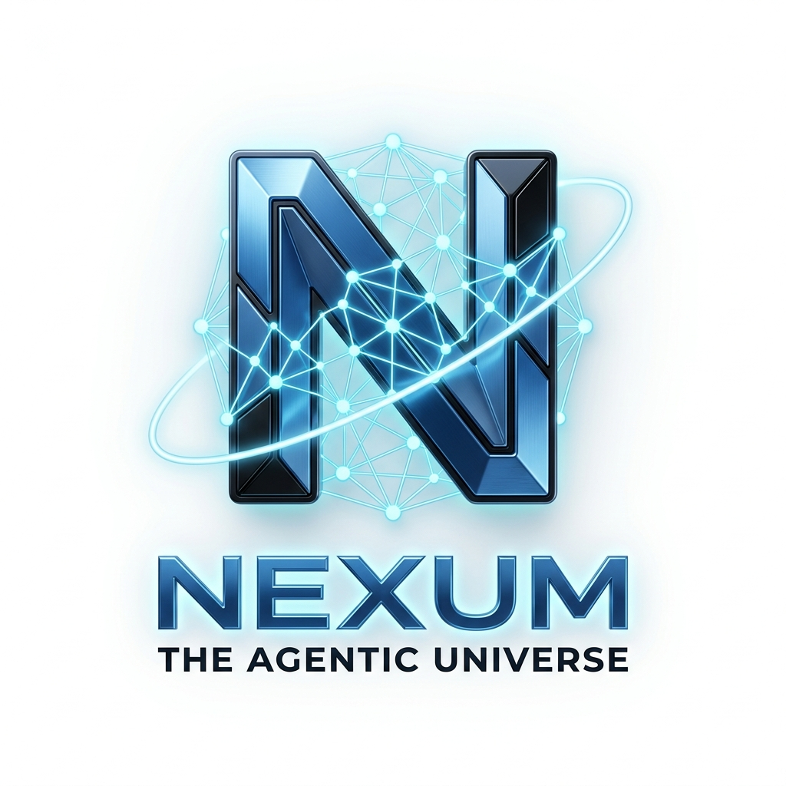
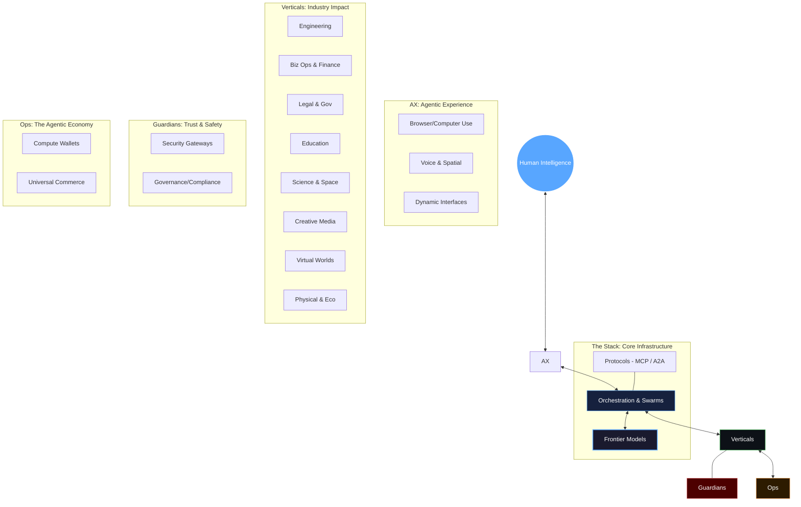

<div align="center">



# NEXUM: The Agentic Universe 🌌
### *The Definitive Repository for the Autonomous Era (2026 Edition)*

[](https://git.io/typing-svg)

<br/>

[](https://awesome.re)&nbsp;
[](https://opensource.org/licenses/MIT)&nbsp;
[](http://makeapullrequest.com)&nbsp;
[](#)&nbsp;
[](#)&nbsp;
[](#)

</div>

---

<div align="center">

## 🌐 The NEXUM Architecture



</div>

---

<div align="center">

## 🧭 Expedition Compass

| [🚀 The Stack](#-the-agentic-stack) | [🌐 Experience](#-the-agentic-experience-ax) | [💼 Verticals](#-vertical-industry-agents) | [🛡️ Guardians](#-guardians-security--governance) |
|:---:|:---:|:---:|:---:|
| Models, Frameworks, Protocols | Browser, Voice, Computer Use | Coding, Legal, Edu, Art, Space, Bots | Security, Compliance, Alignment |

| [🛠️ Operations](#-agent-operations-ops) | [📈 Market Pulse](#-market-pulse--intel) | [🎓 Knowledge](#-knowledge-hub) | [🤝 Community](#-join-the-vanguard) |
|:---:|:---:|:---:|:---:|
| Workflow, Economy, Payments | Star Rankings, Q1/Q2 Trends | 2025 Review, 2027 Outlook | Contributing, Updates |

</div>

---

## 📈 Market Pulse & Intel

### 🔥 The NEXUM Heatmap (May 2026)
> Real-time momentum analysis of the agentic ecosystem.

```text
  Signal                 Momentum        Primary Trend
  ----------------------------------------------------------------------
  Claude Code            9.8/10         The IDE is now an Agent
  Agentic Security       9.6/10         OWASP Top 10 becomes the standard
  Physical Reasoning     9.3/10         GR00T N1.7 commercially viable
  Inter-Agent Comms      9.0/10         A2A v1.0 + MCP mainstream
  Coding Agent IDEs      8.9/10         Cursor $2B ARR; 8-agent parallelism
  Agentic Commerce       8.5/10         UCP-enabled autonomous buys
  Voice Agents           8.2/10         Sub-100ms latency, 70+ languages
  Enterprise Workflow    8.0/10         n8n $1B; Dify/Langflow 100k stars
  Humanoid Robotics      7.8/10         Atlas in manufacturing; CLOi homes
  World Models           7.5/10         AMI Labs $1B seed; Cosmos 3 preview
```

### 🏆 The Titans (By GitHub Stars)
```text
  AutoGPT           ██████████████████████████████████████████████████ 180k+
  LangChain         ██████████████████████████████████████████████    115k+
  Open Interpreter  ██████████████████████████████████                65k+
  Cline / Roo Code  ████████████████████████████████                  63k+
  CrewAI            ████████████████████████████                      45k+
  LangGraph         ██████████████████                                26k+
```

---

## 🚀 The Agentic Stack
*The infrastructure layer powering the autonomous world.*

### 🧠 Intelligence (Frontier Models)
- **[GPT-5.4 Family](https://openai.com)** `🔥 Proprietary` — Adaptive thinking (Thinking/mini/nano); 2M context; GPT-4o deprecated.
- **[Claude 4.6 (Opus/Sonnet)](https://claude.ai)** `🔥 Proprietary` — SWE-bench king (85%+); native parallel agent orchestration. Now includes built-in A2A v1.0 negotiation support.
- **[Gemini 3.1 Ultra](https://gemini.google.com)** `Proprietary` — Deep integration with Google Workspace. Now serves as the primary intelligence layer for mass-deployed 2026 VLA robot controllers.
- **[DeepSeek-R5](https://github.com/deepseek-ai)** `Open Source` — Moore's Law of reasoning; massive performance-to-cost disruption.
- **[Qwen 3.0 Max](https://github.com/QwenLM/Qwen)** `🆕 Open Weights` — Breaks previous SWE-bench records for open weights. Natively supports MCP and 1M context for long-horizon agentic reasoning.
- **[Llama 4.5 Agentic](https://llama.meta.com)** `Open Weights` — Fine-tuned specifically for tool-calling and long-horizon planning. Achieves near-parity with GPT-5.4 on 2026 autonomous multi-step reasoning benchmarks.

### 🚀 Orchestration (Frameworks)
- **[LangGraph](https://github.com/langchain-ai/langgraph)** `🔥 MIT` — Industry standard for stateful, cyclic agent graphs.
- **[CrewAI](https://github.com/joaomdmoura/crewAI)** `🔥 MIT` — Role-based multi-agent collaboration framework. Now includes native telemetric observability and optimized A2A v1.0 swarming.
- **[Microsoft AutoGen 2.0](https://github.com/microsoft/autogen)** `Apache 2.0` — Re-architected for high-concurrency commercial deployments.
- **[Swarm v2.0](https://github.com/openai/swarm)** `🆕 MIT` — The new industry standard for lightweight, stateless multi-agent orchestration, fully replacing the deprecated OpenAI Agents SDK.
- **[Claude Agent SDK](https://docs.anthropic.com)** `MIT` — Focused on accuracy, sandboxing, and MCP native integration.
- **[Agno (formerly Phidata)](https://github.com/agno-agi/agno)** `MIT` — Versatile framework for building multimodal agents with advanced memory and reasoning capabilities.
- **[MetaGPT](https://github.com/geekan/MetaGPT)** `🆕 MIT` — Multi-agent framework that simulates software company roles (PM, engineer) for autonomous development.

### 🛣️ Connectivity (Protocols & Standards)
- **[Model Context Protocol (MCP)](https://modelcontextprotocol.io)** `🔥 Anthropic` — Universal "USB-C" for connecting AI to any data source.
- **[Agent2Agent (A2A) v1.0](https://developers.google.com)** `🆕 Google` — Cross-platform protocol for agents to negotiate and swap data.
- **[Universal Commerce Protocol (UCP)](https://developers.google.com/shopping)** `Google` — Standard for agents representing buyers/sellers in digital markets.

### 📱 Local & Edge (On-Device Agents)
- **[Ollama](https://github.com/ollama/ollama)** `🔥 MIT` — The standard runtime for executing local agent models directly on consumer silicon, completely offline.
- **[Apple CoreML Agent Engine](https://developer.apple.com)** `🆕 Proprietary` — Embedded framework allowing agents to silently navigate iOS and macOS file systems without sending data to the cloud.
- **[Jan](https://github.com/janhq/jan)** `AGPL-3.0` — Open-source alternative to the desktop ChatGPT app, heavily optimized for local agent workflows.

---

## 🌐 The Agentic Experience (AX)
*How humans control, monitor, and live alongside agents.*

### 🖥️ Vision & Control (Browser/Computer Use)
- **[Claude Computer Use](https://claude.com)** `🔥 Proprietary` — Direct pixel interaction: "Go book a flight including hotel and car."
- **[Gemini Enterprise Agent Platform](https://cloud.google.com/gemini/agent-platform)** `🔥 Google Cloud` — Launched at Google Cloud Next '26; enterprise-grade platform for building, deploying, and governing Gemini-powered agents with native Wiz and Salesforce Agentforce integrations and eighth-gen TPU support.
- **[OpenAI Operator](https://openai.com)** `Proprietary` — Standalone agent that lives in your OS, managing apps and files.
- **[OpenClaw](https://github.com/openclaw/openclaw)** `🆕 Open Source` — Local-first personal AI assistant that connects to over 50 integrations to seamlessly manage digital workflows.
- **[Cline / Roo Code](https://github.com/cline/cline)** `MIT` — The ultimate dev workflow agent: terminal, files, and browser in one loop.
- **[Open Interpreter](https://github.com/KillianLucas/open-interpreter)** `MIT` — The standard for natural language control of local machines.

### 🎙️ Voice & Presence
- **[Vapi.ai](https://vapi.ai)** `🔥 Pay-per-min` — Ultra-low latency voice agents with emotional intelligence.
- **[Cartesia Sonic](https://cartesia.ai)** `🆕 Commercial` — Fastest human-like voice API for real-time agent pipelines; developer-native with sub-100ms latency, designed for high-throughput agentic voice applications.
- **[Bland AI](https://bland.ai)** `Commercial` — Pioneer in enterprise-scale autonomous phone operations.
- **[ElevenLabs + IBM watsonx Orchestrate](https://elevenlabs.io/enterprise)** `🆕 Commercial` — Enterprise voice agent integration (March 2026) bringing ElevenLabs TTS/STT into IBM's agentic orchestration platform; supports 70 languages with regional accents and enterprise security/compliance controls.
- **[ElevenLabs Voice Agents](https://elevenlabs.io)** `Commercial` — High-fidelity avatars and voices for the conversational web.

---

## 💼 Vertical & Industry Agents
*Domain-specific expertise unleashed.*

### 🔧 Engineering & Systems
- **[Claude Code](https://claude.com/code)** `🔥 CLI` — #1 ranked SWE-bench agent; handles entire repo refactors autonomously.
- **[Replit Agent 4](https://replit.com)** `🔥 Freemium` — Cloud IDE agent that autonomously plans, writes, tests, and deploys full apps; Agent 4 introduced parallel task forking with ~90% automatic merge-conflict resolution.
- **[Cursor](https://cursor.com)** `🆕 Freemium` — AI-native VS Code fork that reached $2B ARR in Feb 2026; parallel agents update lets teams run up to 8 simultaneous agents on separate codebase branches via git worktrees.
- **[Devin (Cognition AI)](https://cognition.ai)** `🔥 Commercial` — The first fully autonomous AI software engineer, setting standards for multi-step agentic planning.
- **[Windsurf / Cursor](https://codeium.com/windsurf)** `Freemium` — Next-gen IDEs where the "Flow" is co-driven by context-aware agents.
- **[JetBrains Junie](https://www.jetbrains.com/junie/)** `🆕 Commercial` — AI coding agent deeply integrated into IntelliJ, PyCharm, WebStorm, and GoLand; delivers 30% faster task completion with native GitHub integration and MCP support.
- **[GitHub Copilot Workspace](https://githubnext.com/projects/copilot-workspace)** `🆕 Freemium` — Autonomous issue-to-PR agent embedded in GitHub; opened Claude and Codex model access to all paid plan tiers.
- **[Augment Code](https://augmentcode.com)** `🆕 Commercial` — Built for very large codebases with a 200k-token Context Engine; Code Review Agent achieved highest accuracy on public benchmarks.
- **[OpenCode](https://github.com/sst/opencode)** `🆕 MIT · 147k ⭐` — Open-source terminal coding agent with 6.5M monthly devs; offline operation with local models.
- **[Gemini CLI](https://github.com/google-gemini/gemini-cli)** `🆕 Apache 2.0` — Google's open-source terminal agent backed by Gemini 3.1 Pro; free tier and 1M-token context window.
- **[Aider](https://github.com/paul-gauthier/aider)** `MIT` — Legendary terminal-based pair programmer; masters of multi-file edits.
- **[AgentX by OpenAI](https://openai.com)** `MIT · 12k ⭐` — Autonomous coding agent specializing in legacy migration. Expanded to support full-stack 2026 framework refactoring.
- **[OpenDevin](https://github.com/OpenDevin/OpenDevin)** `🆕 MIT` — Community-driven autonomous AI software engineer capable of executing complex, multi-file codebase operations via A2A protocols.
- **[SWE-agent](https://github.com/princeton-nlp/SWE-agent)** `🆕 MIT` — Open-source agent environment that resolves GitHub issues autonomously, featuring native support for the 2026 MCP specification.

### 💹 Business, Finance & HR
- **[Salesforce Agentforce](https://salesforce.com/agentforce)** `Commercial` — Massive scale CRM automation: sales, service, and marketing agents.
- **[Workday Sana](https://workday.com)** `🔥 Commercial` — Enterprise AI agent suite that automates HR and finance tasks across payroll and workforce planning; integrated directly into Microsoft 365 Copilot.
- **[Claude Cowork](https://claude.ai)** `🔥 Anthropic` — Anthropic's desktop agentic platform with plug-ins for investment banking, equity research, private equity, and wealth management.
- **[Oracle AI Agent Studio](https://oracle.com)** `🆕 Commercial` — Full development platform for building agentic applications on top of Oracle Fusion Cloud HCM, SCM, and CX.
- **[Glean](https://glean.com)** `🆕 Commercial` — The enterprise brain; agents that know everything across Slack, Drive, Jira.
- **[Eightfold AI](https://eightfold.ai)** `Commercial` — Autonomous recruiting: sourcing, screening, and scheduling at inhuman speeds.
- **[Skyclerk](https://skyclerk.com)** `Commercial` — Fully autonomous bookkeeper: categorizes, audits, and reconciles 24/7.

### 🔬 Science & Healthcare
- **[CAS Newton](https://cas.org)** `🔥 April 2026` — Deep scientific discovery agent grounded in 150 years of curated data.
- **[NVIDIA BioNeMo Proteina-Complexa](https://nvidia.com/bionemo)** `🆕 Research` — Protein drug discovery model built on BioNeMo platform; trained on a new open dataset of millions of AI-predicted protein complexes.
- **[AlphaFold 3 Agent](https://deepmind.google)** `Research` — Autonomous protein structure and interaction modeling.
- **[AlethianAI](https://alethianai.com)** `Healthcare` — Medical documentation and coding agents with 99.9% accuracy.

### 📊 Data Analytics & Mathematics
- **[Julius AI](https://julius.ai)** `🔥 Freemium` — The premier data science agent. Autonomously connects to massive data warehouses, runs Python/R environments, and outputs interactive dashboards.
- **[Google Data Commons Agent](https://datacommons.org)** `🆕 Open Source` — Navigates petabytes of public data to autonomously generate comprehensive statistical reports and visual insights.
- **[PandasAI](https://github.com/Sinaptik-AI/pandas-ai)** `MIT` — Conversational interface standard for dataframes, allowing agents to manipulate tabular data without human SQL input.

### 🎮 Virtual Worlds & Gaming
- **[Altera](https://altera.al)** `🔥 Commercial` — Digital humans that live in game environments (e.g., Minecraft); they form societies, build economies, and demonstrate continuous learning.
- **[Oasis Gen-World](https://oasis.ai)** `🆕 Research` — Real-time interactive video agent capable of generating infinite playable game worlds at 60fps based entirely on player actions.
- **[Inworld AI Engine 3.0](https://inworld.ai)** `Commercial` — Autonomous NPC brains with persistent memory grids, dynamically directing gameplay narratives without rigid scripting trees.

### 🤖 Physical AI (Robotics)
- **[NVIDIA Alpamayo](https://nvidia.com)** `🆕 VLA Model` — Vision-Language-Action model: the "General Intelligence" for robots.
- **[NVIDIA Cosmos 3](https://developer.nvidia.com/cosmos)** `🆕 Open Weights` — First world foundation model to unify synthetic world generation, physical AI reasoning, and action simulation.
- **[NVIDIA Isaac GR00T N1.7](https://developer.nvidia.com/isaac/groot)** `🆕 Open Weights` — Reasoning VLA model purpose-built for humanoid robots; commercially viable for real-world deployment.
- **[Boston Dynamics Atlas](https://bostondynamics.com/atlas)** `🆕 Commercial` — Hyundai-deployed humanoid robot; field tests running on VLA reasoning stack with LLM integration.
- **[LG CLOi](https://lg.com/global/robot)** `🆕 Commercial` — Smart home AI robot powered by NVIDIA Jetson Thor; learns and simulates behaviors in virtual environments before home deployment.
- **[Figure 02](https://figure.ai)** `Commercial` — Humanoid worker agents deployed in manufacturing (BMW/Mercedes).
- **[Covariant](https://covariant.ai)** `Commercial` — Universal warehouse intelligence: order picking and logistics autonomy.

### ⚖️ Law, Legal & Compliance
- **[Harvey AI Autonomous Counsel](https://harvey.ai)** `🔥 Commercial` — Fully agentic legal reasoning. Reviews massive M&A data rooms, redlines contracts autonomously, and drafts litigation strategies.
- **[Robin AI Agents](https://robinai.co.uk)** `Commercial` — Contract routing and negotiation agents that automatically negotiate standard clauses with opposing counsel via email.
- **[LexisNexis Lexis+ AI Agent](https://lexisnexis.com)** `Commercial` — Shepardizes cases and autonomously generates comprehensive legal briefs backed by primary law citations.

### 🎓 Education & Tutoring
- **[Khanmigo Horizon](https://khanacademy.org)** `🆕 Non-Profit` — Re-architected 2026 tutor agent that proactively monitors student struggles, custom-generates curriculums, and negotiates study schedules.
- **[Synthesis Tutor Swarm](https://synthesis.com)** `Commercial` — Multi-agent virtual classrooms where AI facilitators prompt Socratic debates and moderate complex group problem-solving.

### 🎨 Creative Arts, Media & Entertainment
- **[Sora Director Studio](https://openai.com/sora)** `🔥 Proprietary` — Autonomous filmmaking agent. Feed it a script, and it autonomously handles casting (virtual actors), storyboarding, and timeline generation.
- **[Udio Composer Agent](https://udio.com)** `Commercial` — Iteratively composes multi-stem orchestral and modern tracks, taking structural feedback like a human music producer.
- **[Runway Gen-4 Auto-Editor](https://runwayml.com)** `Commercial` — Agentic video editor that reviews raw footage, identifies best takes, and automatically splices narrative sequences together.

### 🌍 Earth, Ecology & Space
- **[Planet Labs Eco-Agent](https://planet.com)** `🆕 Commercial` — Autonomous satellite orchestration; it detects deforestation or wildfires and instantly re-tasks satellite swarms without human intervention.
- **[NASA AutoRover Protocol](https://nasa.gov)** `Open Source` — VLA-based navigation system for autonomous off-world rovers capable of executing multi-day geological surveys entirely untethered.
- **[Blue River Swarm](https://bluerivertechnology.com)** `Commercial` — Agricultural drone and tractor swarms communicating via A2A to autonomously plant, weed, and harvest based on micro-climate data.

---

## 🛡️ Guardians: Security & Governance
*Ensuring the autonomous world stays safe and aligned.*

- **[Witness AI](https://witness.ai)** `🚨 $58M Raised` — The "Cortex" for enterprise security: monitors and intercepts agentic intent.
- **[Cisco Splunk AI SOC Agents](https://cisco.com/splunk)** `🔥 Commercial` — Suite of specialized agents for security operations automating alert triage and threat response at machine speed with OWASP Agentic AI Top 10 coverage.
- **[CrowdStrike Charlotte AI](https://crowdstrike.com)** `🆕 Commercial` — Agentic SOC platform built into Falcon Next-Gen SIEM; mission-ready agents that automate triage, investigation, and response tasks.
- **[Palo Alto Prisma AIRS 3.0](https://paloaltonetworks.com/prisma/airs)** `🆕 Commercial` — Comprehensive AI security platform spanning the full agentic lifecycle: pre-deployment discovery, real-time inline defense, and automated red-teaming.
- **[Wiz Security Agents](https://wiz.io)** `🆕 Commercial` — Agent-specific cloud security; supports AWS AgentCore, Gemini Enterprise Agent Platform, Azure Copilot Studio, and Salesforce Agentforce.
- **[Microsoft Agent Governance Toolkit](https://github.com/microsoft/agent-governance-toolkit)** `🆕 MIT` — Open-source runtime security toolkit that addresses all 10 OWASP Agentic AI risks with deterministic sub-millisecond policy enforcement.
- **[Lakera Guard](https://www.lakera.ai)** `🆕 Commercial` — Enterprise-grade security gateway that intercepts and prevents prompt injections and malicious agentic intent in real-time.
- **[BlacksmithAI](https://github.com/blacksmithai)** `🆕 Open Source` — Multi-agent penetration testing framework that mirrors real-world red team structures with specialized agents for recon and exploit execution.
- **[Norton Agent Shield](https://norton.com)** `🆕 2026` — Consumer-grade protection for local agents on personal devices.

---

## 🛠️ Agent Operations (Ops)
*The tools that make agents work at scale.*

### 🏗️ Workflow & Low-Code
- **[n8n](https://n8n.io)** `🔥 Fair-code · 180k ⭐ · $1B valuation` — The leading self-hosted agentic workflow platform with native MCP and A2A support. Raised Series B and C to reach $1B valuation.
- **[Dify](https://dify.ai)** `🆕 MIT · 100k+ ⭐` — LLM application development platform supporting multi-agent orchestration, RAG pipelines, and visual workflow construction.
- **[Langflow](https://langflow.org)** `🆕 MIT · 100k+ ⭐` — Visual agent builder with drag-and-drop construction of multi-agent flows and native LangChain, MCP, and A2A protocol support.
- **[Lindy](https://lindy.ai)** `🆕 Commercial` — No-code personal AI agent builder for automating recurring tasks across email, calendar, CRM, and Slack.
- **[Bolt.new / v0](https://bolt.new)** `Commercial` — Full-stack generation: from prompt to production in seconds.

### 💳 Economy & Payments
- **[Stripe Agent Billing](https://stripe.com/agents)** `🆕 Commercial` — API infrastructure enabling agents to meter computational usage and bill users autonomously. Dominating Q2 2026 agent economy transaction volumes.
- **[Coinbase Agent Wallet](https://coinbase.com)** `infrastructure` — Enables any agent to hold crypto and pay for compute.
- **[Skyfire](https://skyfire.xyz)** `Financial` — The banking layer for AI: enables agents to hold money and pay for their own resources.
- **[Helicone](https://helicone.ai)** `Freemium` — Observability with ROI tracking and agentic throttling.

---

## 🏛️ The NEXUM Standard
### *How we curate the world's best list*

To be included in NEXUM, a project must undergo the **Lead Designer's Vetting Process**:
1.  **Autonomy Tier**: Must demonstrate multi-step reasoning without human micro-management.
2.  **2026 Resilience**: Must support modern protocols (MCP, A2A, or VLA).
3.  **Community Velocity**: Active development with high-fidelity documentation.
4.  **Operational Safety**: Built-in guardrails or compatibility with Guardian systems.

---

## 🤝 Join the Vanguard

### 🛰️ Contributing
1. **Fork** the repo.
2. **Standardize:** `- **[Name](Link)** \`License\` — Description with specific 2026 context.`
3. **Verify:** Targeted entry into the correct Architectural Layer.

### 🌍 Community
- **Discussion:** [GitHub Discussions](https://github.com/HA2345567/awesome-autonomus-ai-agents/discussions)
- **Pulse:** Follow #NexumAI on X/LinkedIn

---

<div align="center">

**[Star this Repository](https://github.com/HA2345567/awesome-autonomus-ai-agents)** to join the Agentic Revolution.

*Curated with ❤️ by NEXUM | Last Updated: May 17, 2026*

</div>