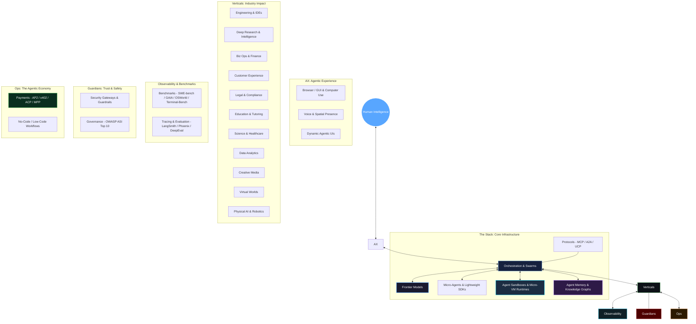

<div align="center">

# NEXUM: The Agentic Universe 🌌
### *The Definitive Repository for the Autonomous Era (2026 Edition)*

[](https://git.io/typing-svg)

<br/>

[](https://awesome.re)&nbsp;
[](https://opensource.org/licenses/MIT)&nbsp;
[](http://makeapullrequest.com)&nbsp;
[](#)&nbsp;
[](#)

[**Explore Stack**](#-the-agentic-stack) • [**What's New**](#-whats-new-right-now-q3-2026-at-a-glance) • [**Commerce Protocol**](#-agentic-commerce--payments-protocols) • [**OWASP Security**](#️-guardians-security--governance) • [**Contribute**](#-join-the-vanguard)

</div>

---

## 🆕 What's New Right Now (Q3 2026 at a glance)

> [!IMPORTANT]
> **The fastest-moving corner of the ecosystem** — read this section first if you last checked in before summer.

- 🧠 **Model layer reshuffled:** Anthropic shipped **Claude Opus 4.8** and **Claude Sonnet 5** as the current flagship/mid-tier pair, alongside **Claude Haiku 4.5**. Above Opus sits a new **Mythos tier**: **Claude Mythos 5** and **Claude Fable 5** launched June 9, 2026, were briefly suspended June 12–July 1 for export-control compliance, and are now restored. OpenAI, Google, and open-weight models all advanced rapidly — see [Intelligence](#-intelligence-frontier-models) below.
- 🚀 **Orchestration consolidated:** Microsoft folded **AutoGen** and **Semantic Kernel** into the unified **Microsoft Agent Framework (MAF) 1.0**, GA since April 2026. **Google ADK 2.0** moved to a graph-based execution engine. **PydanticAI V2** shipped a "harness-first" redesign. **LangGraph 1.0**, **CrewAI 1.14**, and the new **Claude Agent SDK** all now ship native MCP + A2A support.
- 💻 **The coding-agent wars shifted:** **Google Antigravity 2.0** (built on the Windsurf acqui-hire) and **Cursor 3 / Composer 2.5** are now serious rivals to **Claude Code** and **OpenAI Codex CLI** — while the original **Windsurf** IDE retired and relaunched as **Devin Desktop**.
- 💳 **Agentic commerce is production infrastructure:** Google's **AP2**, Coinbase's **x402** (now under the Linux Foundation's x402 Foundation), OpenAI's **ACP**, and the newer **MPP** rail all shipped production integrations in H1 2026 — see the brand-new [Agentic Commerce & Payments Protocols](#-agentic-commerce--payments-protocols) section.
- 🛡️ **Security gained a unified standard:** **OWASP's Top 10 for Agentic Applications (ASI Top 10)** — covering risks like Agent Goal Hijack and Memory/Context Poisoning — is now the reference security framework cited across the Guardians layer.

---

## 📖 Table of Contents

| # | Section | What's Inside |
|:---:|:---|:---|
| 1 | [📈 Market Pulse & Intel](#-market-pulse--intel) | Ecosystem heatmaps, GitHub star titans, Q3 trends |
| 2 | [🚀 The Agentic Stack](#-the-agentic-stack) | Frontier models, orchestration, micro-agents, sandboxes, memory, protocols, edge runtimes |
| 3 | [🌐 The Agentic Experience (AX)](#-the-agentic-experience-ax) | Browser/computer use, GUI vision models, voice & spatial presence |
| 4 | [💼 Vertical & Industry Agents](#-vertical--industry-agents) | Engineering, deep research, CX, enterprise ops, finance, science, data, robotics, legal |
| 5 | [📊 Agent Evaluation, Tracing & Observability](#-agent-evaluation-tracing--observability) | SWE-bench, Terminal-Bench 2.1, OpenTelemetry, unit testing & evaluation suites |
| 6 | [🛡️ Guardians: Security & Governance](#️-guardians-security--governance) | Security gateways, guardrails, red-teaming, OWASP ASI Top 10 framework |
| 7 | [💰 Agentic Commerce & Payments Protocols](#-agentic-commerce--payments-protocols) | 🆕 AP2, x402, ACP, MPP settlement, agent wallet infrastructure |
| 8 | [🛠️ Agent Operations & Economy](#-agent-operations--economy) | Workflow automation, low-code builders, sub-cent request billing & metering |
| 9 | [🏛️ The NEXUM Standard](#️-the-nexum-standard) | Curation methodology & vetting requirements |
| 10 | [🤝 Join the Vanguard](#-join-the-vanguard) | Contribution guidelines, community discussions |

---

<div align="center">

## 🌐 The NEXUM Architecture



</div>

---

## 📈 Market Pulse & Intel

### 🔥 The NEXUM Heatmap (Q3 2026)
> Real-time momentum analysis of the agentic ecosystem.

```text
  Signal                     Momentum        Primary Trend
  ------------------------------------------------------------------------------
  Coding-Agent Consolidation 9.9/10         Antigravity 2.0, Cursor 3, Codex CLI, Claude Code duke it out
  Agentic Commerce & Payments 9.9/10        AP2 + x402 + ACP + MPP go into production
  Browser-Use & GUI          9.8/10         LLM Web & OS Automation goes mainstream
  Deep Research Agents       9.8/10         Perplexity & OpenAI Deep Research lead web reasoning
  Framework Consolidation    9.7/10         AutoGen + Semantic Kernel merge into Microsoft Agent Framework
  Agent Memory Systems       9.7/10         Mem0 & Letta bring persistent OS-like memory
  Agent Sandboxes (E2B)      9.7/10         Micro-VM sandboxing becomes infrastructure default
  Agentic Security (OWASP)   9.7/10         ASI Top 10 becomes the reference risk framework
  Agent Observability        9.6/10         OpenTelemetry tracing & evaluation standards
  PydanticAI & Mastra        9.4/10         Lightweight, type-safe micro-agent frameworks boom
  Physical Reasoning         9.3/10         GR00T N1.7 & Cosmos 3 commercially deployed
  Inter-Agent Comms          9.2/10         MCP + A2A v1.0 (150+ orgs) unify agent-to-agent handoffs
  Agentic Payments Rails     9.1/10         x402 Foundation + Stripe/Coinbase/Visa stablecoin settlement
  Voice & Spatial AX         8.4/10         Sub-80ms audio-to-audio streaming pipelines
```

### 🏆 The Titans (By GitHub Stars)
```text
  AutoGPT           ██████████████████████████████████████████████████ 185k+
  OpenCode          █████████████████████████████████████████████████ 180k+ 🆕
  LangChain         ██████████████████████████████████████████████    120k+
  Dify              ████████████████████████████████████████          108k+
  n8n               █████████████████████████████████████             102k+
  Browser-Use       ███████████████████████████████████               80k+
  Open Interpreter  ████████████████████████████████                  68k+
  Cline / Roo Code  ███████████████████████████████                   67k+
  CrewAI            █████████████████████████                         54k+
  Smolagents        ████████████████████                              44k+
  LangGraph         █████████████████                                 38k+
  Mem0              ██████████████                                    28k+
  E2B Sandboxes     ████████████                                      22k+
```

---

## 🚀 The Agentic Stack
*The infrastructure layer powering the autonomous world.*

### 🧠 Intelligence (Frontier Models)
- **[GPT-5.4 / GPT-5.5 Family](https://openai.com/index/introducing-gpt-5-4/)** `🔥 Proprietary` — OpenAI's frontier reasoning family for professional work, multi-modal coding, computer use, and long-horizon agent execution; GPT-5.5 currently tops the public Terminal-Bench 2.1 leaderboard via Codex CLI.
- **[Claude Opus 4.8 / Sonnet 5 / Haiku 4.5](https://www.anthropic.com/claude)** `🔥 Proprietary` — Anthropic's current flagship agentic line: Opus 4.8 for maximum reasoning depth, Sonnet 5 for fast agentic day-to-day work, and Haiku 4.5 for low-latency tasks.
- **[Claude Mythos 5 / Claude Fable 5](https://www.anthropic.com/news/fable-mythos-access)** `🆕 Proprietary` — Anthropic's new above-Opus "Mythos" tier, first released June 9, 2026; Fable 5 shares the same underlying model with added safety measures for bio/cyber/LLM-R&D domains. Restored July 1, 2026 following export-control compliance review.
- **[Gemini 3.1 / 3.5 Pro & Flash](https://ai.google.dev/models/gemini)** `Proprietary` — Google's frontier multimodal model family with 2M+ context, native tool execution, agentic coding, and the fast, low-cost Gemini 3.5 Flash tier powering Antigravity 2.0.
- **[DeepSeek V4 / V3.2](https://api-docs.deepseek.com/quick_start/pricing/)** `Open Weights / API` — DeepSeek's open reasoning and coding model line, offering cost-efficient frontier intelligence and native agentic function calling.
- **[Qwen 3.0 Max](https://github.com/QwenLM/Qwen)** `Open Weights` — Alibaba's open-weight model family with native MCP integration, 1M context, and top open-source SWE-bench scores.
- **[Llama 4.5 Agentic](https://llama.meta.com)** `Open Weights` — Meta's open-weight foundation model family optimized for local agent deployment, tool execution, and multi-agent coordination.
- **[Kimi K2.5](https://github.com/MoonshotAI)** `🆕 Open Weights` — Moonshot AI's open-source base model, serving as the foundation under Cursor's in-house Composer 2.5 agent after heavy RL post-training.

### 🚀 Orchestration (Frameworks)
- **[Microsoft Agent Framework (MAF) 1.0](https://github.com/microsoft/agent-framework)** `🆕 🔥 MIT` — Microsoft's official successor to AutoGen and Semantic Kernel, reaching GA in April 2026 across Python and .NET with declarative YAML config, native MCP, and A2A integration.
- **[LangGraph 1.0](https://github.com/langchain-ai/langgraph)** `🔥 MIT` — The enterprise standard for stateful, cyclic multi-agent graphs, featuring MCP tools as first-class streaming graph nodes.
- **[Google Agent Development Kit (ADK) 2.0](https://github.com/google/adk)** `🆕 Apache 2.0` — Google's code-first agent toolkit, rebuilt around a graph-based execution engine at Google I/O 2026 with deep Gemini and Cloud Run integration.
- **[Claude Agent SDK](https://pypi.org/project/claude-agent-sdk/)** `🆕 Anthropic · MIT` — Anthropic's official SDK for building custom agents on the Claude Code harness, using MCP as its primary tool contract.
- **[CrewAI 1.14](https://github.com/joaomdmoura/crewAI)** `🔥 MIT` — Role-based multi-agent collaboration framework with built-in telemetry, enterprise flows, and native MCP/A2A swarming support.
- **[PydanticAI V2](https://github.com/pydantic/pydantic-ai)** `🆕 🔥 MIT` — Type-safe Python agent framework with a "harness-first" redesign bundling tools, hooks, instructions, and model settings into composable capability primitives.
- **[Mastra](https://github.com/mastra-ai/mastra)** `🆕 Apache 2.0` — TypeScript-native agent framework tailored for full-stack JavaScript and Node.js teams.
- **[LlamaIndex Workflows 1.0](https://github.com/run-llama/llama_index)** `Apache 2.0` — Event-driven workflow engine from LlamaIndex for RAG-heavy and data-centric multi-agent pipelines with native MCP support.
- **[AG2](https://github.com/ag2ai/ag2)** `🆕 Apache 2.0` — Community-driven continuation of original AutoGen v0.2, maintained by former creators.
- **[Camel-AI](https://github.com/camel-ai/camel)** `MIT` — Pioneer multi-agent framework exploring communicational agent behavior and cooperative task execution.
- **[Agno (formerly Phidata)](https://github.com/agno-agi/agno)** `MIT` — High-performance framework for lightweight, multimodal agents with vector memory and fast reasoning loops.

### ⚡ Micro-Agents & Lightweight SDKs
- **[Smolagents](https://github.com/huggingface/smolagents)** `🔥 Apache 2.0 · 44k ⭐` — Hugging Face's ultra-lightweight library for code-first agents where actions are clean Python code blocks.
- **[PydanticAI V2](https://github.com/pydantic/pydantic-ai)** `🔥 MIT` — Fast, type-safe micro-agent building with native Pydantic data validation and structured output guarantees.
- **[Goose](https://github.com/block/goose)** `Apache 2.0` — Block's open-source extensible AI agent that runs in your terminal to automate shell scripts, code edits, and environment operations.
- **[Micro-Agent](https://github.com/builderio/micro-agent)** `MIT` — Builder.io's lightweight agent that writes code, executes tests in a sandbox, and iteratively fixes errors until tests pass.

### 🔒 Agent Sandboxes & Execution Runtimes
- **[E2B (Code Interpreter Sandboxes)](https://github.com/e2b-dev/E2B)** `🔥 Apache 2.0 · 22k ⭐` — Secure cloud micro-VM sandboxes used by Devin, Cursor, and Perplexity for running agent code safely isolated.
- **[Daytona](https://github.com/daytonaio/daytona)** `🔥 Apache 2.0` — Open-source development environment manager and agent sandbox runtime enabling instant isolated workspace provisioning.
- **[Modal Micro-VM Runtimes](https://modal.com/)** `Commercial` — Serverless infrastructure optimized for ultra-low latency agent sandboxing, code execution, and GPU workloads.
- **[Docker Agent Sandbox](https://www.docker.com/)** `Apache 2.0` — Containerized execution environments optimized for isolating local and enterprise agent file/code operations.

### 🧠 Agent Memory & Context Layer
- **[Mem0](https://github.com/mem0ai/mem0)** `🔥 Apache 2.0 · 28k ⭐` — The intelligent memory layer for AI agents; provides persistent user, session, and domain memory across agentic interactions.
- **[Letta (formerly MemGPT)](https://github.com/letta-ai/letta)** `🔥 Apache 2.0` — Stateful AI agent framework managing multi-tier memory (RAM/Disk) like an operating system for long-term retention.
- **[Zep / Graphiti](https://github.com/getzep/graphiti)** `Apache 2.0` — Temporal knowledge graph engine that dynamically extracts and updates episodic memory for autonomous agents.
- **[Supermemory](https://github.com/supermemoryai/supermemory)** `MIT` — Open-source build-your-own memory engine for AI agents with document vectorization and temporal search.
- **[Cognee](https://github.com/topobyte/cognee)** `Apache 2.0` — Memory management and graph-RAG pipeline for LLMs and agents, organizing unstructured context into searchable knowledge graphs.

### 🛣️ Connectivity (Protocols & Standards)
- **[Model Context Protocol (MCP)](https://modelcontextprotocol.io)** `🔥 Anthropic` — The universal open standard ("USB-C for AI") connecting agents to external data sources, tools, and environments; primary tool contract for Claude Agent SDK and MAF 1.0.
- **[Agent2Agent (A2A) v1.0](https://developers.google.com)** `🔥 Google` — Open protocol enabling heterogeneous AI agents to negotiate tasks and exchange data; backed by 150+ organizations with production SDKs in Python, JS, Java, Go, and .NET.
- **[Agent Network Protocol (ANP)](https://agent-network-protocol.com)** `Open Standard` — Decentralized communication standard for P2P inter-agent messaging and discovery.
- **[Universal Commerce Protocol (UCP)](https://developers.google.com/shopping)** `Google` — Protocol for autonomous buy-and-sell agents to execute commercial transactions across digital storefronts.

### 📱 Local & Edge (On-Device Agents)
- **[Ollama](https://github.com/ollama/ollama)** `🔥 MIT` — The premier local engine for running quantized agent models offline on consumer hardware with zero data leakage.
- **[Apple CoreML Agent Engine](https://developer.apple.com)** `Proprietary` — On-device framework allowing agents to access local file systems, native apps, and Apple Silicon neural engines securely.
- **[Jan](https://github.com/janhq/jan)** `AGPL-3.0` — Open-source local desktop AI assistant supporting local tool execution, extension plugins, and offline model runtimes.

---

## 🌐 The Agentic Experience (AX)
*How humans control, monitor, and live alongside agents.*

### 🖥️ Vision & Control (Browser / Computer / GUI Use)
- **[Browser-Use](https://github.com/browser-use/browser-use)** `🔥 MIT · 80k ⭐` — The leading open-source library for controlling web browsers via LLM agents; enables automated form filling, scraping, and SaaS interaction.
- **[Stagehand](https://github.com/browserbase/stagehand)** `🔥 MIT` — Browserbase's AI-first browser automation SDK built on Playwright with natural language actions, extraction, and observation.
- **[Skyvern](https://github.com/Skyvern-AI/skyvern)** `🔥 Apache 2.0` — Open-source vision + LLM browser automation agent capable of navigating complex websites without brittle CSS selectors.
- **[UI-Tars](https://github.com/bytedance/ui-tars)** `Open Source` — ByteDance's GUI agent model trained for direct vision-based computer and web interaction across Windows, macOS, and mobile.
- **[Claude Computer Use / Claude in Chrome](https://claude.com)** `🔥 Proprietary` — Direct visual screen perception and mouse/keyboard action execution, available as a dedicated browser agent extension.
- **[OpenAI Operator](https://openai.com)** `Proprietary` — Autonomous browser agent capable of executing complex web tasks like travel booking, shopping, and research.
- **[Cline / Roo Code](https://github.com/cline/cline)** `MIT` — VS Code extension agent featuring full autonomous terminal, file edit, and browser preview loops.
- **[Open Interpreter](https://github.com/KillianLucas/open-interpreter)** `MIT` — Natural language command-line agent executing code locally across Python, JS, Shell, and native OS apps.

### 🎙️ Voice & Presence
- **[Vapi.ai](https://vapi.ai)** `🔥 Commercial` — Developer platform for building sub-100ms ultra-low latency conversational voice agents with emotional nuance.
- **[Cartesia Sonic](https://cartesia.ai)** `Commercial` — Sub-80ms voice generation API designed for real-time streaming agentic voice conversations.
- **[Bland AI](https://bland.ai)** `Commercial` — Enterprise platform for building and scaling autonomous phone-call agent swarms for sales and operations.
- **[ElevenLabs + IBM watsonx Orchestrate](https://elevenlabs.io/enterprise)** `Commercial` — Enterprise voice integration bringing ElevenLabs high-fidelity voice synthesis into IBM's agentic workflow platform across 70+ languages.

---

## 💼 Vertical & Industry Agents
*Domain-specific expertise unleashed.*

### 🔧 Engineering & Systems
- **[Claude Code](https://claude.com/code)** `🔥 CLI` — Anthropic's terminal-native agent; highest reasoning ceiling in the category (69.2% SWE-bench Pro with Opus 4.8), featuring parallel subagents and background sessions.
- **[Google Antigravity 2.0](https://antigravity.google)** `🆕 🔥 Freemium` — Google's parallel-agent IDE built on the Windsurf acqui-hire; features split Editor View / Manager Surface for spawning and supervising multiple agents, powered by Gemini 3.5 Flash.
- **[Cursor 3 (Composer 2.5)](https://cursor.com)** `🆕 🔥 Freemium` — AI-native code editor powered by Composer 2.5 (built on Kimi K2.5), scoring ~79.8% SWE-Bench Multilingual at lower compute costs with parallel worktree execution.
- **[OpenAI Codex CLI](https://openai.com/codex)** `🆕 Freemium` — OpenAI's standalone cloud/CLI coding agent, #1 on the public Terminal-Bench 2.1 leaderboard with GPT-5.5.
- **[Devin Desktop (formerly Windsurf)](https://cognition.ai)** `🆕 Commercial` — Cognition's relaunch of the Windsurf IDE, integrating the Devin cloud agent and Devin Terminal CLI for autonomous micro-VM runs.
- **[Kiro](https://kiro.dev)** `Commercial` — Spec-driven development IDE with event-driven hooks for structured spec-first code generation.
- **[OpenCode](https://github.com/sst/opencode)** `🔥 MIT · 180k+ ⭐` — SST's open-source, model-agnostic terminal coding agent; the most-starred open-source terminal coding agent for local offline workflows.
- **[Trae](https://www.trae.ai/)** `Freemium` — ByteDance's adaptive AI-native IDE integrating context-aware coding agents into workspace workflows.
- **[Google Jules](https://jules.google)** `🆕 Freemium` — Google's asynchronous GitHub-issue-to-PR coding agent.
- **[Replit Agent 4](https://replit.com)** `Freemium` — Autonomous cloud IDE agent that plans, builds, tests, and deploys full-stack applications with parallel branch merging.
- **[GitHub Copilot (Cloud Agent)](https://github.com/features/copilot)** `Commercial` — GitHub-native issue-to-PR automation with flexible billing and cloud agent delegation.
- **[Aider](https://github.com/paul-gauthier/aider)** `MIT` — Command-line pair programmer with git integration and automated commit formatting.
- **[SWE-agent](https://github.com/princeton-nlp/SWE-agent)** `MIT` — Princeton's open agent framework designed to solve GitHub issues autonomously.
- **[OpenHands (formerly OpenDevin)](https://github.com/All-Hands-AI/OpenHands)** `MIT` — Open-source community project building autonomous software development agents.
- **[JetBrains Junie](https://www.jetbrains.com/junie/)** `Commercial` — Embedded agent for IntelliJ, PyCharm, and WebStorm with native MCP and codebase grounding.

### 🔍 Deep Research & Intelligence
- **[Perplexity Deep Research](https://www.perplexity.ai/)** `🔥 Proprietary` — Autonomous multi-step research agent executing dozens of web queries, citations, and analytical synthesis to produce exhaustive reports.
- **[OpenAI Deep Research](https://openai.com/)** `🔥 Proprietary` — Deep research agent that browses hundreds of web sources asynchronously and generates long-form research papers.
- **[Stanford STORM](https://github.com/stanford-oval/storm)** `🔥 MIT` — Synthesis of Topic Outlines through Grounded LLM Multi-Agent Interaction for generating structured, Wikipedia-style deep research reports.
- **[Hebbia Matrix](https://www.hebbia.ai/)** `Commercial` — Enterprise research agent analyzing thousands of financial, legal, and unstructured documents simultaneously in a spreadsheet interface.

### 💹 Business, Finance & HR
- **[Salesforce Agentforce](https://salesforce.com/agentforce)** `Commercial` — Autonomous enterprise agent suite across CRM, sales pipeline, service triage, and marketing workflows.
- **[Claude Cowork](https://claude.ai)** `🆕 Anthropic` — Desktop agentic platform for knowledge work — reconciling spend, building trackers from contract folders, and assembling decks from transcripts across connected apps.
- **[Workday Sana](https://workday.com)** `Commercial` — Enterprise AI agent suite automating HR, payroll, procurement, and financial operations.
- **[SAP Joule Studio 2.0](https://sap.com)** `Commercial` — Enterprise agent layer for supply chain, HCM, and ERP business processes across SAP environments.
- **[Microsoft Agent 365](https://microsoft.com)** `Commercial` — Control plane for building, deploying, and governing business agents inside Microsoft 365 environments.
- **[Glean](https://glean.com)** `Commercial` — Enterprise search and autonomous agent engine connected across Slack, Google Drive, Jira, and Notion.

### 🎧 Customer Experience & Support
- **[Intercom Fin](https://www.intercom.com/fin)** `🔥 Commercial` — AI customer support agent resolving user queries without human intervention across chat and email.
- **[Zendesk AI Agents](https://www.zendesk.com/service/ai/ai-agents/)** `Commercial` — Customer service agent suite with automated resolution workflows across omnichannel tickets.
- **[Sierra](https://sierra.ai)** `Commercial` — Enterprise CX agent platform utilizing supervisor agent patterns to maintain brand alignment and safe execution.
- **[Decagon](https://decagon.ai)** `Commercial` — Voice, chat, and email CX agents built with continuous testing and evaluation loops.
- **[Maven AGI](https://www.mavenagi.com)** `Commercial` — Multi-channel enterprise support agent engine with real-time knowledge synthesis.

### 🧑‍💼 Work Management & Enterprise Ops
- **[ServiceNow AI Agent Studio](https://www.servicenow.com)** `Commercial` — Enterprise workflow agent builder for IT service management (ITSM), HR delivery, and ops automation.
- **[Atlassian Rovo Agents](https://www.atlassian.com/rovo)** `Commercial` — Specialized AI teammates integrated into Jira, Confluence, and enterprise work graphs.
- **[Asana AI Teammates](https://asana.com/product/ai/ai-teammates)** `Commercial` — Collaborative agents that track goals, follow up on deliverables, and assign work inside Asana.
- **[ClickUp Brain Agents](https://clickup.com/brain)** `Commercial` — Context-aware workspace agents for project planning, doc writing, and task management.

### 🔬 Science & Healthcare
- **[CAS Newton](https://cas.org)** `Commercial` — Deep scientific discovery agent grounded in 150+ years of chemical and biological research data.
- **[NVIDIA BioNeMo](https://nvidia.com/bionemo)** `Research` — Generative AI and agent framework for biomolecular discovery, protein structure prediction, and drug target validation.
- **[AlphaFold 3 Agent](https://deepmind.google)** `Research` — DeepMind's structural biology system modeling joint structures of proteins, DNA, RNA, and ligands.
- **[Abridge](https://www.abridge.com)** `Healthcare` — Clinical documentation agent structuring doctor-patient encounters into clinical notes and EHR updates.
- **[Ambience Healthcare](https://www.ambiencehealthcare.com)** `Healthcare` — Operating system for AI clinical documentation, coding, and compliance workflows.
- **[Hippocratic AI](https://www.hippocraticai.com)** `Healthcare` — Safety-focused non-diagnostic healthcare agents for patient follow-up, scheduling, and health education.

### 📊 Data Analytics & Mathematics
- **[Julius AI](https://julius.ai)** `Freemium` — Interactive data science agent running Python/R scripts to analyze spreadsheets, generate charts, and build predictive models.
- **[Databricks Genie](https://docs.databricks.com/en/genie/)** `Commercial` — Governed enterprise data agent grounded in Unity Catalog data lakes and workspace intelligence.
- **[Snowflake Cortex Agents](https://docs.snowflake.com/en/user-guide/snowflake-cortex/cortex-agents)** `Commercial` — Autonomous analytics agents querying structured tables and unstructured documents inside Snowflake.
- **[Microsoft Fabric Data Agents](https://learn.microsoft.com/en-us/fabric/data-science/concept-data-agent)** `Commercial` — Conversational data agents for OneLake, Power BI, and Microsoft Graph.

### 🎮 Virtual Worlds & Gaming
- **[Altera](https://altera.al)** `Commercial` — Autonomous digital humans operating in virtual sandbox worlds (e.g. Minecraft), demonstrating emergent social behaviors and economies.
- **[Oasis Gen-World](https://oasis.ai)** `Research` — Real-time world generation engine creating infinite interactive game environments on the fly.
- **[Inworld AI Engine 3.0](https://inworld.ai)** `Commercial` — Dynamic NPC brain framework providing persistent memory, emotion models, and adaptive narrative execution.

### 🤖 Physical AI (Robotics)
- **[NVIDIA Cosmos 3](https://developer.nvidia.com/cosmos)** `Open Weights` — Foundation world model for physical AI, robotics simulation, and synthetic dataset generation.
- **[NVIDIA Isaac GR00T N1.7](https://developer.nvidia.com/isaac/groot)** `Open Weights` — Vision-Language-Action (VLA) foundation reasoning model built specifically for humanoid robots.
- **[Boston Dynamics Atlas](https://bostondynamics.com/atlas)** `Commercial` — Fully electric humanoid robot powered by VLA physical reasoning stacks for industrial manufacturing.
- **[Figure 02](https://figure.ai)** `Commercial` — Commercial humanoid worker agent deployed in automotive manufacturing lines (BMW/Mercedes).
- **[LG CLOi](https://lg.com/global/robot)** `Commercial` — Smart home humanoid robot using edge AI reasoning to execute household physical chores.

### ⚖️ Law, Legal & Compliance
- **[Harvey AI](https://harvey.ai)** `Commercial` — Legal reasoning agent platform for law firms and corporate legal teams, automating contract analysis, redlining, and research.
- **[Robin AI](https://robinai.co.uk)** `Commercial` — Contract negotiation agent automatically evaluating standard agreement terms and drafting revisions.
- **[LexisNexis Lexis+ AI Agent](https://lexisnexis.com)** `Commercial` — Legal research agent generating verified briefs grounded in primary legal authorities.

---

## 📊 Agent Evaluation, Tracing & Observability
*Measuring accuracy, latency, execution trajectories, unit assertions, and cost.*

### 📈 Benchmarks & Leaderboards
- **[SWE-bench / SWE-bench Verified / SWE-bench Pro](https://www.swebench.com/)** `🔥 Standard` — The industry benchmark evaluating software engineering agents on real GitHub issues from popular open-source repositories.
- **[Terminal-Bench 2.1](https://www.tbench.ai/)** `🆕 Benchmark` — Fast-rising standard for evaluating CLI/terminal coding agents (Codex CLI, Claude Code, Cursor, Antigravity) via the open Harbor evaluation framework.
- **[GAIA (General AI Assistants)](https://huggingface.co/spaces/gaia-benchmark/leaderboard)** `🔥 Benchmark` — Benchmark testing multimodal AI agents on complex, multi-step real-world tasks requiring browsing, calculation, and tool use.
- **[OSWorld](https://os-world.github.io/)** `OS Benchmark` — Operating system interaction benchmark assessing agents' visual screen perception and mouse/keyboard execution on Windows, Ubuntu, and macOS.
- **[WebArena & Tau-Bench](https://webarena.dev/)** `Benchmark` — Web-based environment benchmarks evaluating autonomous web navigation, e-commerce transactions, and customer service workflows.
- **[Humanity's Last Exam (HLE)](https://cais.community/hle/)** `Benchmark` — Frontier multimodal benchmark designed to evaluate advanced agentic reasoning across academic and technical disciplines.

### 🔬 Tracing, Telemetry & Evaluation Suites
- **[LangSmith](https://www.langchain.com/langsmith)** `🔥 Commercial` — Industry-standard developer platform for tracing, testing, evaluating, and monitoring LLM applications and agentic graphs.
- **[Langfuse](https://langfuse.com)** `🔥 Open Source · MIT` — Open-source observability and evaluation platform for AI agents, featuring detailed trace visualizations, cost tracking, and prompt management.
- **[Arize Phoenix](https://phoenix.arize.com)** `🔥 Open Source` — AI observability platform built on OpenTelemetry for tracing agent execution loops, evaluation metrics, and tool execution call stacks.
- **[AgentOps](https://www.agentops.ai)** `🔥 Freemium` — Purpose-built observability platform for multi-agent systems, tracking agent session replays, LLM costs, tool failures, and recursion loops.
- **[DeepEval / DeepTeam](https://github.com/confident-ai/deepeval)** `Apache 2.0` — Open-source LLM & agent unit testing and red-teaming framework, featuring OWASP ASI Top 10 test coverage.
- **[Promptfoo](https://github.com/promptfoo/promptfoo)** `MIT` — CLI & library for evaluating agent prompts, tool calls, agentic security vulnerabilities, and automated red-teaming.
- **[Braintrust](https://www.braintrust.dev/)** `Commercial` — Enterprise evaluation stack for automated agent testing, prompt playground experiments, and CI/CD quality gates.
- **[Comet Opik](https://www.comet.com/site/products/opik/)** `Open Source` — End-to-end LLM evaluation and agent tracing platform supporting custom metrics, automated evaluation, and real-time monitoring.
- **[Traceloop (OpenLLMetry)](https://www.traceloop.com/)** `Open Source` — OpenTelemetry-native telemetry standard for monitoring agent traces across OpenTelemetry collectors (Datadog, Dynatrace, New Relic).

---

## 🛡️ Guardians: Security & Governance
*Ensuring the autonomous world stays safe, aligned, and compliant.*

> [!NOTE]
> **The reference security standard:** The [OWASP Top 10 for Agentic Applications (ASI Top 10)](https://genai.owasp.org/resource/owasp-top-10-for-agentic-applications-for-2026/), published with 100+ contributing organizations, is the shared industry baseline. It enforces **Least-Agency** (granting only necessary autonomy) and **Strong Observability** (mandatory audit logging of goal state and tool paths), classifying 10 risk domains from Agent Goal Hijack (ASI01) to Rogue Agents (ASI10).

- **Witness AI** `Commercial` — Enterprise security control plane monitoring and intercepting agentic intent, preventing unauthorized system actions.
- **[Cisco Splunk AI SOC Agents](https://cisco.com/splunk)** `Commercial` — Specialized security operations agents automating alert triage, incident investigation, and threat mitigation with OWASP ASI Top 10 coverage.
- **[CrowdStrike Charlotte AI](https://crowdstrike.com)** `Commercial` — Agentic SOC platform inside Falcon SIEM automating threat hunting, triage, and mitigation routines.
- **[Palo Alto Prisma AIRS 3.0](https://paloaltonetworks.com/prisma/airs)** `Commercial` — Security suite covering full agent lifecycles: pre-deployment scanning, inline prompt protection, and red-teaming, explicitly mapped to the OWASP ASI Top 10.
- **[Wiz Security Agents](https://wiz.io)** `Commercial` — Cloud security guardrails designed specifically for AWS AgentCore, Gemini Enterprise Agent Platform, and Salesforce Agentforce.
- **[Microsoft Agent Governance Toolkit](https://github.com/microsoft/agent-governance-toolkit)** `MIT` — Open-source runtime toolkit enforcing safety constraints, identity boundaries, and OWASP compliance on AI agents.
- **[Lakera Guard](https://www.lakera.ai)** `Commercial` — High-speed enterprise guardrail intercepting prompt injections, jailbreaks, and sensitive data leakage in real-time.
- **[NeMo Guardrails](https://github.com/NVIDIA/NeMo-Guardrails)** `Apache 2.0` — NVIDIA's open-source toolkit for adding programmable safety, security, and topical rails to agentic LLMs.
- **[Guardrails AI](https://www.guardrailsai.com/)** `Apache 2.0` — Validation framework ensuring agent outputs conform to strict structural, safety, and semantic constraints.
- **[NeuralTrust](https://neuraltrust.ai)** `🆕 Commercial` — Agentic-security platform built directly around the OWASP ASI Top 10 (Goal Hijack, Tool Misuse, Privilege Abuse, Memory Poisoning).

---

## 💰 Agentic Commerce & Payments Protocols
*🆕 Production rails enabling autonomous agents to execute financial transactions.*

> [!TIP]
> **The transacting agent economy:** Analysts project agentic commerce will influence $3–5 trillion in transactions by 2030. This section separates authorization, communication, and settlement protocols.

- **[Agent Payments Protocol (AP2)](https://cloud.google.com/blog/products/ai-machine-learning/announcing-agents-to-payments-ap2-protocol)** `🔥 Google` — An authorization and trust framework using cryptographically signed "mandates" to prove human user authorization for agent purchases. Backed by 60+ partners including Amex, Coinbase, Mastercard, PayPal, and Salesforce.
- **[x402 Protocol](https://github.com/coinbase/x402)** `🔥 Coinbase / x402 Foundation` — Open protocol reviving HTTP 402 for instant stablecoin (USDC) micropayments between agents and APIs without accounts or API keys. Co-governed by the Linux Foundation and Cloudflare.
- **[A2A x402 Extension](https://developers.google.com)** `🆕 Google` — Bridges Google's A2A protocol to x402 settlement, enabling agents to discover services, authorize via AP2, and settle via x402 in a single flow.
- **[Agentic Commerce Protocol (ACP)](https://openai.com)** `🆕 OpenAI` — Powers ChatGPT Instant Checkout as an open protocol supported by Stripe, Shopify, Salesforce, and PayPal.
- **[Multi-Party Payments (MPP)](https://stripe.com)** `🆕 Consortium` — Settlement rail supporting multi-party transaction splits across Stripe, Visa, Mastercard, Anthropic, OpenAI, and Shopify.
- **[Amazon Bedrock AgentCore Payments](https://aws.amazon.com/bedrock/agentcore/)** `🆕 AWS` — Managed AWS capability enabling Bedrock agents to negotiate x402 payments, authenticate wallets, and enforce spending caps.
- **[Coinbase Agent Wallet](https://coinbase.com)** `Infrastructure` — On-chain wallet infrastructure empowering agents to hold crypto, pay for compute, and settle smart contracts.
- **[Crossmint](https://www.crossmint.com)** `Commercial` — Enterprise agent wallet platform unified across x402, AP2 mandates, and conversational checkout with programmable guardrails.
- **[Skyfire](https://skyfire.xyz)** `Financial` — Banking and payment network enabling AI agents to hold balances and pay merchant endpoints.

> [!WARNING]
> **Security Precaution:** Agentic payment rails require strict governance. Always enforce the principle of Least-Agency and configure strict spending caps on agent wallet credentials.

---

## 🛠️ Agent Operations & Economy
*Workflow tools, orchestration platforms, and sub-cent request metering.*

### 🏗️ Workflow & Low-Code
- **[n8n](https://n8n.io)** `🔥 Fair-code · 102k ⭐` — Leading self-hosted workflow automation platform with native MCP tools, A2A protocols, and visual multi-agent builders.
- **[Dify](https://dify.ai)** `🔥 MIT · 108k+ ⭐` — Open-source LLM app development platform supporting multi-agent workflow graphs, RAG pipelines, and model routing.
- **[Langflow](https://langflow.org)** `MIT` — Visual drag-and-drop agent framework with native LangChain, MCP, and multi-agent graph capabilities.
- **[Lindy](https://lindy.ai)** `Commercial` — No-code agent builder automating personal and business task workflows across email, calendar, CRM, and communication apps.
- **[Bolt.new / v0](https://bolt.new)** `Commercial` — Full-stack web application generation environments driven by autonomous code agents.

### 💳 Metering & Billing
- **[Stripe Agent Billing](https://stripe.com/agents)** `🔥 Commercial` — API infrastructure enabling AI agents to bill for compute usage, manage subscriptions, and process micro-transactions; interoperable with ACP, x402, and MPP.
- **[Helicone](https://helicone.ai)** `Freemium` — LLM observability and cost management platform providing usage throttling, API rate-limiting, and cost allocation per agent session.
- **[Nevermined](https://nevermined.ai)** `🆕 Commercial` — Purpose-built billing platform for sub-cent, per-request agent metering built on top of x402-style settlement.

---

## 🏛️ The NEXUM Standard
### *How we curate the world's best list*

To be included in NEXUM, a project must undergo the **Lead Designer's Vetting Process**:
1.  **Autonomy Tier**: Must demonstrate multi-step reasoning without human micro-management.
2.  **2026 Resilience**: Must support modern protocols (MCP, A2A, ACP/AP2/x402, or VLA).
3.  **Community Velocity**: Active development with high-fidelity documentation and proven usage.
4.  **Operational Safety**: Built-in guardrails, telemetry hooks, or compatibility with the OWASP ASI Top 10 and other Guardian systems.

---

## 🤝 Join the Vanguard

### 🛰️ Contributing
1. **Fork** the repo.
2. **Standardize:** `- **[Name](Link)** \`License\` — Description with specific 2026 context.`
3. **Verify:** Targeted entry into the correct Architectural Layer.

### 🌍 Community
- **Discussion:** [GitHub Discussions](https://github.com/HA2345567/awesome-autonomus-ai-agents/discussions)
- **Pulse:** Follow #NexumAI on X/LinkedIn

---

<div align="center">

**[Star this Repository](https://github.com/HA2345567/awesome-autonomus-ai-agents)** to join the Agentic Revolution.

*Curated with ❤️ by NEXUM | Last Updated: Q3 2026 (July)*

</div>