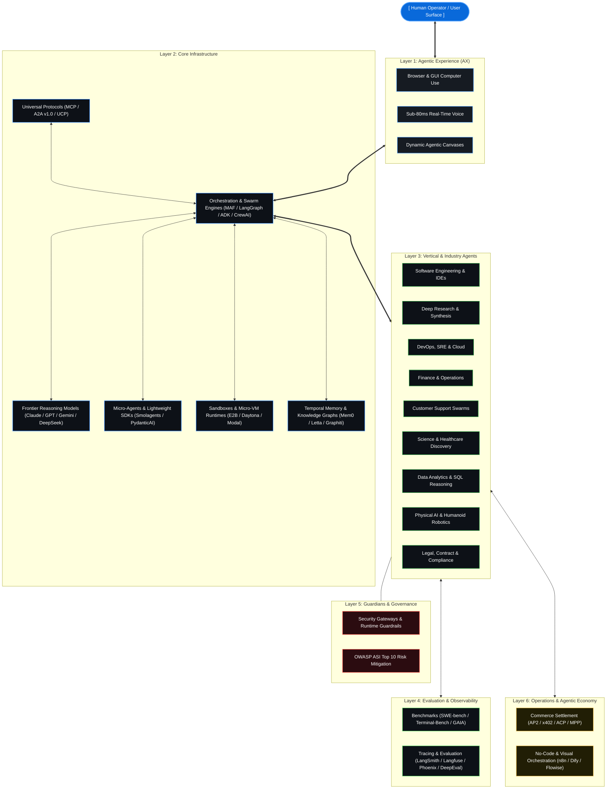

<div align="center">

# NEXUM : The Agentic Universe
### *The Definitive Open-Source Directory & Architectural Standard for Autonomous AI (2026 Edition)*

<p align="center">
  <b>Architecting the Autonomous Frontier • 300+ Curated Agents, Orchestration Frameworks, Runtimes & Protocols</b>
</p>

[](https://git.io/typing-svg)

<br/>

[](https://awesome.re)&nbsp;
[](https://opensource.org/licenses/MIT)&nbsp;
[](#01-whats-new-right-now-q3-2026-digest)&nbsp;
[](#03-the-agentic-stack)&nbsp;
[](#07-guardians-security--governance)&nbsp;
[](http://makeapullrequest.com)&nbsp;
[](https://github.com/HA2345567/awesome-autonomus-ai-agents/discussions)

<br/>

[**Explore Stack**](#03-the-agentic-stack) &nbsp;•&nbsp; [**What's New**](#01-whats-new-right-now-q3-2026-digest) &nbsp;•&nbsp; [**Architecture**](#02-the-nexum-architecture) &nbsp;•&nbsp; [**Vertical Agents**](#05-vertical--industry-agents) &nbsp;•&nbsp; [**Commerce Protocols**](#08-agentic-commerce--payments-protocols) &nbsp;•&nbsp; [**Security Matrix**](#07-guardians-security--governance) &nbsp;•&nbsp; [**Contribute**](#11-join-the-vanguard)

</div>

---

## 01. What's New Right Now (Q3 2026 Digest)

> [!IMPORTANT]
> **Ecosystem Velocity Report** — Curated breakthrough signals across frontier reasoning, parallel code agents, commerce rails, and safety governance.

- **Models & Frontier Reasoning** `Anthropic Mythos` `Mistral Agentic` `OpenAI o3/o4`  
  Claude Opus 4.8 / Sonnet 5, Mythos 5 & Fable 5 restored after compliance review; Mistral NeMo Agentic 2 launched with native MCP calling; OpenAI o3/o4-mini frontier reasoning suites deployed.  
  → *Explore: [Frontier Models](#31-intelligence-frontier-models)*

- **Orchestration & Swarms** `Microsoft MAF 1.0` `Google ADK 2.0` `PydanticAI V2`  
  AutoGen & Semantic Kernel unified into Microsoft Agent Framework (MAF 1.0); Google ADK 2.0 graph engine; PydanticAI V2 harness redesign with composable capability primitives.  
  → *Explore: [Orchestration Frameworks](#32-orchestration-frameworks)*

- **Parallel Coding Agents** `Antigravity 2.0` `Codex CLI` `Cursor 3`  
  Google Antigravity 2.0 (parallel agents) & Cursor 3 rival Claude Code & OpenAI Codex CLI (#1 Terminal-Bench 2.1); Devin Desktop relaunched; Agent QA self-repairing regression tests.  
  → *Explore: [Engineering Agents](#51-engineering--systems)*

- **Commerce & Settlement Rails** `Google AP2` `Coinbase x402` `OpenAI ACP`  
  Google AP2 mandates, Coinbase x402 (Linux Foundation), OpenAI ACP & Stripe MPP processing real-world autonomous micro-transactions with cryptographically signed user mandates.  
  → *Explore: [Commerce Protocols](#08-agentic-commerce--payments-protocols)*

- **Security & Governance Standards** `OWASP ASI Top 10` `Least-Agency Baseline`  
  Universal risk baseline addressing Goal Hijack (ASI01) & Context Poisoning (ASI04) adopted across enterprise agent security gateways and runtime guardrails.  
  → *Explore: [Guardians & Safety](#07-guardians-security--governance)*

- **Connectivity & Protocols** `MCP-A2A Bridge v1.2` `Universal Standards`  
  Unified Anthropic MCP tool contexts & Google A2A inter-agent negotiation protocols for seamless cross-framework handoffs across 150+ partner organizations.  
  → *Explore: [Protocols & Standards](#36-connectivity-protocols--standards)*

---

## 02. The NEXUM Architecture

The NEXUM framework categorizes the autonomous universe into 8 tightly coupled layers — from human-in-the-loop interaction surfaces down to execution sandboxes and settlement rails.

<div align="center">



</div>

---

## 📖 Table of Contents

| Section | Architecture Domain | Detailed Contents |
| :--- | :--- | :--- |
| **[01. What's New](#01-whats-new-right-now-q3-2026-digest)** | Digest | Q3 2026 breakthroughs across models, tools, and protocols |
| **[02. Architecture](#02-the-nexum-architecture)** | Blueprint | 8-layer structural blueprint of the autonomous ecosystem |
| **[03. The Agentic Stack](#03-the-agentic-stack)** | Core Infra | [Frontier Models](#31-intelligence-frontier-models) • [Orchestration](#32-orchestration-frameworks) • [Micro-Agents](#33-micro-agents--lightweight-sdks) • [Sandboxes](#34-agent-sandboxes--execution-runtimes) • [Memory](#35-agent-memory--context-layer) • [Protocols](#36-connectivity-protocols--standards) • [Local & Edge](#37-local--edge-on-device-agents) |
| **[04. Agentic Experience (AX)](#04-the-agentic-experience-ax)** | Interaction | [Browser & GUI Computer Use](#41-vision--control-browser--computer--gui-use) • [Voice & Streaming Presence](#42-voice--presence) |
| **[05. Vertical & Industry Agents](#05-vertical--industry-agents)** | Applied AI | [Engineering](#51-engineering--systems) • [DevOps/SRE](#52-devops-sre--cloud-infrastructure) • [Deep Research](#53-deep-research--intelligence) • [Business/Finance](#54-business-finance--hr) • [CX Support](#55-customer-experience--support) • [Enterprise Ops](#56-work-management--enterprise-ops) • [Science/Healthcare](#57-science--healthcare) • [Data Analytics](#58-data-analytics--mathematics) • [Gaming](#59-virtual-worlds--gaming) • [Robotics](#510-physical-ai-robotics) • [Legal](#511-law-legal--compliance) • [Design](#512-creative-media--design) • [Education](#513-education--adaptive-learning) |
| **[06. Evaluation & Observability](#06-agent-evaluation-tracing--observability)** | Telemetry | [Benchmarks & Leaderboards](#61-benchmarks--leaderboards) • [Tracing & Evaluation Suites](#62-tracing-telemetry--evaluation-suites) |
| **[07. Guardians & Governance](#07-guardians-security--governance)** | Safety | [Security Gateways & Guardrails](#71-security-gateways--guardrails) • [OWASP ASI Top 10 Risk Matrix](#72-owasp-top-10-for-agentic-applications-asi-top-10) |
| **[08. Agentic Commerce](#08-agentic-commerce--payments-protocols)** | Monetization | [Commerce Protocols & Wallets](#81-commerce-protocols--wallets) • [Payment Protocol Matrix](#82-agentic-payments-protocol-matrix) |
| **[09. Operations & Economy](#09-agent-operations--economy)** | Ops & Billing | [Workflow & Low-Code Engines](#91-workflow--low-code) • [Metering & Sub-Cent Billing](#92-metering--billing) |
| **[10. The NEXUM Standard](#10-the-nexum-standard)** | Methodology | Lead Designer Vetting Process & Inclusion Criteria |
| **[11. Join the Vanguard](#11-join-the-vanguard)** | Community | [Contribution Workflow](#111-contributing-workflow) • [Contributors](#112-contributors) • [Star History](#113-star-history) |

---

## 03. The Agentic Stack
*The core infrastructure layer powering the autonomous world.*

### 3.1. Intelligence (Frontier Models)
- **[GPT-5.4 / GPT-5.5 Family](https://openai.com/index/introducing-gpt-5-4/)** `Proprietary` `Flagship` — OpenAI's frontier reasoning family for professional work, multi-modal coding, computer use, and long-horizon agent execution; GPT-5.5 currently tops the public Terminal-Bench 2.1 leaderboard via Codex CLI.
- **[OpenAI o3 / o4-mini](https://openai.com/)** `Proprietary` `Reasoning` — OpenAI's frontier reasoning models featuring adaptive chain-of-thought compute, deep multi-step math/code synthesis, and native function calling.
- **[Claude Opus 4.8 / Sonnet 5 / Haiku 4.5](https://www.anthropic.com/claude)** `Proprietary` `Flagship` — Anthropic's flagship agentic line: Opus 4.8 for maximum reasoning depth, Sonnet 5 for fast agentic day-to-day work, and Haiku 4.5 for low-latency tasks.
- **[Claude Mythos 5 / Claude Fable 5](https://www.anthropic.com/news/fable-mythos-access)** `Proprietary` `High-Security` — Anthropic's new above-Opus "Mythos" tier, first released June 9, 2026; Fable 5 shares the same underlying model with added safety measures for bio/cyber/LLM-R&D domains. Restored July 1, 2026 following export-control compliance review.
- **[Gemini 3.1 / 3.5 Pro & Flash](https://ai.google.dev/models/gemini)** `Proprietary` `Multimodal` — Google's frontier multimodal model family with 2M+ context, native tool execution, agentic coding, and the fast, low-cost Gemini 3.5 Flash tier powering Antigravity 2.0.
- **[DeepSeek V4 / V3.2 / R1](https://api-docs.deepseek.com/quick_start/pricing/)** `Open Weights` `Reasoning` — DeepSeek's open reasoning and coding model line, offering cost-efficient frontier intelligence, open weights distillation, and native agentic function calling.
- **[Qwen 3.0 Max](https://github.com/QwenLM/Qwen)** `Open Weights` — Alibaba's open-weight model family with native MCP integration, 1M context, and top open-source SWE-bench scores.
- **[Llama 4.5 Agentic](https://llama.meta.com)** `Open Weights` — Meta's open-weight foundation model family optimized for local agent deployment, tool execution, and multi-agent coordination.
- **[Kimi K2.5](https://github.com/MoonshotAI)** `Open Weights` — Moonshot AI's open-source base model, serving as the foundation under Cursor's in-house Composer 2.5 agent after heavy RL post-training.
- **[Mistral NeMo Agentic 2 / Large 3](https://mistral.ai/)** `Open Weights` `Tool-Optimized` — Mistral AI's agent-optimized open model series engineered for high-throughput tool calling, structured outputs, and complex MCP action execution.
- **[Cohere Command R+ (Agentic)](https://cohere.com/command)** `Commercial` `Enterprise-RAG` — Scalable enterprise model purpose-built for multi-step tool use, grounded RAG citations, and automated business workflows.

### 3.2. Orchestration (Frameworks)
- **[Microsoft Agent Framework (MAF) 1.0](https://github.com/microsoft/agent-framework)** `MIT` `GA Release` — Microsoft's official successor to AutoGen and Semantic Kernel, reaching GA in April 2026 across Python and .NET with declarative YAML config, native MCP, and A2A integration.
- **[LangGraph 1.0](https://github.com/langchain-ai/langgraph)** `MIT` `Enterprise Standard` — The enterprise standard for stateful, cyclic multi-agent graphs, featuring MCP tools as first-class streaming graph nodes.
- **[Google Agent Development Kit (ADK) 2.0](https://github.com/google/adk)** `Apache 2.0` `Graph Engine` — Google's code-first agent toolkit, rebuilt around a graph-based execution engine at Google I/O 2026 with deep Gemini and Cloud Run integration.
- **[Claude Agent SDK](https://pypi.org/project/claude-agent-sdk/)** `MIT` `Anthropic Official` — Anthropic's official SDK for building custom agents on the Claude Code harness, using MCP as its primary tool contract.
- **[CrewAI 1.14](https://github.com/joaomdmoura/crewAI)** `MIT` `54k Stars` — Role-based multi-agent collaboration framework with built-in telemetry, enterprise flows, and native MCP/A2A swarming support.
- **[PydanticAI V2](https://github.com/pydantic/pydantic-ai)** `MIT` `Type-Safe` — Type-safe Python agent framework with a "harness-first" redesign bundling tools, hooks, instructions, and model settings into composable capability primitives.
- **[AutoGen (v0.4+ Event-Driven)](https://github.com/microsoft/autogen)** `MIT` `Distributed Actors` — Microsoft's redesigned asynchronous, event-driven multi-agent framework featuring distributed agent actors, pluggable memory, and scalable swarms.
- **[Semantic Kernel](https://github.com/microsoft/semantic-kernel)** `MIT` `Multi-Language` — Microsoft's enterprise-grade SDK for integrating AI services into C#, Python, and Java applications with rich plugin architecture and agent orchestration.
- **[Mastra](https://github.com/mastra-ai/mastra)** `Apache 2.0` `TypeScript Native` — TypeScript-native agent framework tailored for full-stack JavaScript and Node.js teams.
- **[MetaGPT](https://github.com/geekan/MetaGPT)** `MIT` `46k Stars` — Multi-agent framework that assigns Standard Operating Procedures (SOPs) to simulated software company roles (PM, Architect, Engineer, QA).
- **[ChatDev](https://github.com/OpenBMB/ChatDev)** `Apache 2.0` `26k Stars` — Communicative agent ecosystem simulating a virtual software development company to build applications from scratch through collaborative dialogue.
- **[LlamaIndex Workflows 1.0](https://github.com/run-llama/llama_index)** `Apache 2.0` `Event-Driven RAG` — Event-driven workflow engine from LlamaIndex for RAG-heavy and data-centric multi-agent pipelines with native MCP support.
- **[AG2](https://github.com/ag2ai/ag2)** `Apache 2.0` — Community-driven continuation of original AutoGen v0.2, maintained by former creators.
- **[Camel-AI](https://github.com/camel-ai/camel)** `MIT` — Pioneer multi-agent framework exploring communicational agent behavior and cooperative task execution.
- **[Agno (formerly Phidata)](https://github.com/agno-agi/agno)** `MIT` `High-Performance` — High-performance framework for lightweight, multimodal agents with vector memory and fast reasoning loops.
- **[SuperAGI](https://github.com/TransformerOptimus/SuperAGI)** `Apache 2.0` — Open-source developer-first autonomous AI agent framework designed to build, manage, and run autonomous agents with GUI dashboard management and multi-vector memory.
- **[AutoGen Studio](https://github.com/microsoft/autogen/tree/main/python/packages/autogen-studio)** `MIT` `Visual UI` — Interactive low-code UI for rapid multi-agent prototyping, visual skill creation, and session debugging.

### 3.3. Micro-Agents & Lightweight SDKs
- **[Smolagents](https://github.com/huggingface/smolagents)** `Apache 2.0` `44k Stars` — Hugging Face's ultra-lightweight library for code-first agents where actions are clean Python code blocks.
- **[ControlFlow](https://github.com/PrefectHQ/ControlFlow)** `Apache 2.0` `Task-Centric` — Prefect's task-centric, Pythonic agent framework designed to weave autonomous agents into structured, observable workflows.
- **[Goose](https://github.com/block/goose)** `Apache 2.0` — Block's open-source extensible AI agent that runs in your terminal to automate shell scripts, code edits, and environment operations.
- **[Micro-Agent](https://github.com/builderio/micro-agent)** `MIT` — Builder.io's lightweight agent that writes code, executes tests in a sandbox, and iteratively fixes errors until tests pass.
- **[BabyAGI 2.0](https://github.com/yoheinakajima/babyagi)** `MIT` — The evolution of the original autonomous task planner into a minimalist, modular micro-agent framework.
- **[OpenBB Agents](https://github.com/OpenBB-finance/OpenBBTerminal)** `Apache 2.0` `Financial SDK` — Specialized lightweight financial research micro-agents grounded in market data endpoints.

### 3.4. Agent Sandboxes & Execution Runtimes
- **[E2B (Code Interpreter Sandboxes)](https://github.com/e2b-dev/E2B)** `Apache 2.0` `22k Stars` — Secure cloud micro-VM sandboxes used by Devin, Cursor, and Perplexity for running agent code safely isolated.
- **[Daytona](https://github.com/daytonaio/daytona)** `Apache 2.0` — Open-source development environment manager and agent sandbox runtime enabling instant isolated workspace provisioning.
- **[Modal Micro-VM Runtimes](https://modal.com/)** `Commercial` `Serverless GPU` — Serverless infrastructure optimized for ultra-low latency agent sandboxing, code execution, and GPU workloads.
- **[Fly.io MicroVM Machines](https://fly.io/docs/machines/)** `Commercial` `Global Edge` — Ephemeral micro-VM infrastructure for provisioning isolated, sub-second execution sandboxes across global edge locations.
- **[Runloop](https://www.runloop.ai/)** `Commercial` `Managed Sandbox` — Cloud platform providing managed developer environments and sandboxes optimized for AI coding agents and benchmark evaluation.
- **[Firecrawl Extract Engine](https://github.com/mendableai/firecrawl)** `AGPL-3.0` `Web Sandbox` — Turn-key web scraping and sandbox extraction engine that turns any URL into LLM-ready markdown for autonomous agents.
- **[Docker Agent Sandbox](https://www.docker.com/)** `Apache 2.0` — Containerized execution environments optimized for isolating local and enterprise agent file/code operations.

### 3.5. Agent Memory & Context Layer
- **[Mem0](https://github.com/mem0ai/mem0)** `Apache 2.0` `28k Stars` — The intelligent memory layer for AI agents; provides persistent user, session, and domain memory across agentic interactions.
- **[Letta (formerly MemGPT)](https://github.com/letta-ai/letta)** `Apache 2.0` `Stateful OS` — Stateful AI agent framework managing multi-tier memory (RAM/Disk) like an operating system for long-term retention.
- **[Zep / Graphiti](https://github.com/getzep/graphiti)** `Apache 2.0` `Temporal Graph` — Temporal knowledge graph engine that dynamically extracts and updates episodic memory for autonomous agents.
- **[Khoj](https://github.com/khoj-ai/khoj)** `AGPL-3.0` `20k Stars` — Open-source personal AI second brain with offline episodic memory, search indexation across documents, and custom agent creation.
- **[Supermemory](https://github.com/supermemoryai/supermemory)** `MIT` — Open-source build-your-own memory engine for AI agents with document vectorization and temporal search.
- **[Cognee](https://github.com/topobyte/cognee)** `Apache 2.0` — Memory management and graph-RAG pipeline for LLMs and agents, organizing unstructured context into searchable knowledge graphs.
- **[VectorShift Memory Engine](https://www.vectorshift.ai/)** `Commercial` — Enterprise memory and knowledge retrieval infrastructure for autonomous multi-step pipelines.

### 3.6. Connectivity (Protocols & Standards)
- **[Model Context Protocol (MCP)](https://modelcontextprotocol.io)** `Open Standard` `Anthropic` — The universal open standard ("USB-C for AI") connecting agents to external data sources, tools, and environments; primary tool contract for Claude Agent SDK and MAF 1.0.
- **[Agent2Agent (A2A) v1.0](https://developers.google.com)** `Open Standard` `Google` — Open protocol enabling heterogeneous AI agents to negotiate tasks and exchange data; backed by 150+ organizations with production SDKs in Python, JS, Java, Go, and .NET.
- **[Agent Network Protocol (ANP)](https://agent-network-protocol.com)** `Open Standard` — Decentralized communication standard for P2P inter-agent messaging and discovery.
- **[Universal Commerce Protocol (UCP)](https://developers.google.com/shopping)** `Open Standard` `Google` — Protocol for autonomous buy-and-sell agents to execute commercial transactions across digital storefronts.
- **[MCP-A2A Interoperability Bridge v1.2](https://modelcontextprotocol.io)** `Open Standard` — Unified bridge protocol enabling Anthropic MCP tool contexts and Google A2A inter-agent negotiation to seamlessly hand off tasks across agent networks.
- **[OpenAI AgentKit](https://github.com/openai/agent-kit)** `Open Source` — Cryptographic action authorization and wallet interface standard allowing agents to securely interact with third-party Web APIs and on-chain systems.
- **[Open-RPC for Agents](https://open-rpc.org/)** `Open Standard` — JSON-RPC-based interface specification for strongly typed agent tool discovery, validation, and contract calling.
- **[W3C DID Agent Identity Spec](https://www.w3.org/TR/did-core/)** `Open Standard` — Decentralized Identifiers and verifiable credentials establishing immutable identity and cryptographic accountability for autonomous software agents.

### 3.7. Local & Edge (On-Device Agents)
- **[Ollama](https://github.com/ollama/ollama)** `MIT` `120k+ Stars` — The premier local engine for running quantized agent models offline on consumer hardware with zero data leakage.
- **[LM Studio Local Server](https://lmstudio.ai/)** `Proprietary / Free` — Desktop local LLM runtime exposing OpenAI-compatible REST endpoints with GPU acceleration and native tool-calling agent capabilities.
- **[Apple CoreML Agent Engine](https://developer.apple.com)** `Proprietary` — On-device framework allowing agents to access local file systems, native apps, and Apple Silicon neural engines securely.
- **[LocalAI](https://github.com/mudler/LocalAI)** `MIT` `28k Stars` — Free, open-source OpenAI drop-in replacement for local, self-hosted AI agent inference on CPU and GPU.
- **[Jan](https://github.com/janhq/jan)** `AGPL-3.0` — Open-source local desktop AI assistant supporting local tool execution, extension plugins, and offline model runtimes.
- **[Orkas](https://github.com/Orkas-AI/Orkas)** `MIT` — Open-source desktop workspace that coordinates coding agents in parallel or sequence and supports local OpenAI-compatible model endpoints.
- **[Llama.cpp Agent Server](https://github.com/ggerganov/llama.cpp)** `MIT` — High-efficiency C/C++ inference engine running quantized models with low latency on edge devices and servers.

[Back to Top](#nexum--the-agentic-universe)

---

## 04. The Agentic Experience (AX)
*How humans control, monitor, and collaborate alongside autonomous agents.*

### 4.1. Vision & Control (Browser / Computer / GUI Use)
- **[Browser-Use](https://github.com/browser-use/browser-use)** `MIT` `80k Stars` — The leading open-source library for controlling web browsers via LLM agents; enables automated form filling, scraping, and SaaS interaction.
- **[Stagehand](https://github.com/browserbase/stagehand)** `MIT` — Browserbase's AI-first browser automation SDK built on Playwright with natural language actions, extraction, and observation.
- **[Skyvern](https://github.com/Skyvern-AI/skyvern)** `Apache 2.0` `11k Stars` — Open-source vision + LLM browser automation agent capable of navigating complex websites without brittle CSS selectors.
- **[UI-Tars](https://github.com/bytedance/ui-tars)** `Open Source` — ByteDance's GUI agent model trained for direct vision-based computer and web interaction across Windows, macOS, and mobile.
- **[Claude Computer Use / Claude in Chrome](https://claude.com)** `Proprietary` — Direct visual screen perception and mouse/keyboard action execution, available as a dedicated browser agent extension.
- **[OpenAI Operator](https://openai.com)** `Proprietary` — Autonomous browser agent capable of executing complex web tasks like travel booking, shopping, and research.
- **[Cline / Roo Code](https://github.com/cline/cline)** `MIT` `67k Stars` — VS Code extension agent featuring full autonomous terminal, file edit, and browser preview loops.
- **[Open Interpreter](https://github.com/KillianLucas/open-interpreter)** `MIT` `68k Stars` — Natural language command-line agent executing code locally across Python, JS, Shell, and native OS apps.
- **[LaVague](https://github.com/lavague-ai/LaVague)** `Apache 2.0` — Large Action Model (LAM) framework generating executable browser automation code directly from visual web pages and natural language goals.
- **[Playwright AI Agent](https://github.com/microsoft/playwright)** `Apache 2.0` — Microsoft's autonomous end-to-end web testing and browser automation harness powered by vision-language agents.
- **[Agent S (OpenOS)](https://github.com/simular-ai/Agent-S)** `Apache 2.0` — Open-source GUI agent designed to autonomously interact with OS desktops, GUI applications, and multi-window environments.
- **[Cradle](https://github.com/BAAI-Agents/Cradle)** `Apache 2.0` — General computer control framework enabling multimodal agents to master desktop applications and open-world video games.

### 4.2. Voice & Presence
- **[Vapi.ai](https://vapi.ai)** `Commercial` `Sub-100ms Voice` — Developer platform for building sub-100ms ultra-low latency conversational voice agents with emotional nuance.
- **[LiveKit Agents](https://github.com/livekit/agents)** `Apache 2.0` `WebRTC Native` — Open-source framework for building real-time, multi-modal voice and video AI agents over WebRTC with sub-200ms latency.
- **[Cartesia Sonic](https://cartesia.ai)** `Commercial` `Sub-80ms API` — Sub-80ms voice generation API designed for real-time streaming agentic voice conversations.
- **[Retell AI](https://www.retellai.com/)** `Commercial` — Voice AI platform for building human-like conversational telephone and customer interaction agent swarms.
- **[Bland AI](https://bland.ai)** `Commercial` — Enterprise platform for building and scaling autonomous phone-call agent swarms for sales and operations.
- **[Workforce Wave](https://www.workforcewave.com/)** `Commercial` — AI voice receptionist that answers business calls 24/7, books appointments, and captures after-hours leads for small businesses.
- **[ElevenLabs + IBM watsonx Orchestrate](https://elevenlabs.io/enterprise)** `Commercial` — Enterprise voice integration bringing ElevenLabs high-fidelity voice synthesis into IBM's agentic workflow platform across 70+ languages.
- **[Ultravox v0.5](https://github.com/fixie-ai/ultravox)** `Apache 2.0` `Speech-LLM` — Open-source multimodal speech-LLM designed for direct audio-in audio-out conversational agent systems without transcription bottlenecks.

[Back to Top](#nexum--the-agentic-universe)

---

## 05. Vertical & Industry Agents
*Domain-specific intelligence deployed across global enterprise sectors.*

### 5.1. Engineering & Systems
- **[Claude Code](https://claude.com/code)** `CLI Native` `SWE-bench Top Tier` — Anthropic's terminal-native agent; highest reasoning ceiling in the category (69.2% SWE-bench Pro with Opus 4.8), featuring parallel subagents and background sessions.
- **[Google Antigravity 2.0](https://antigravity.google)** `Freemium` `Parallel Agent IDE` — Google's parallel-agent IDE built on the Windsurf acqui-hire; features split Editor View / Manager Surface for spawning and supervising multiple agents, powered by Gemini 3.5 Flash.
- **[Cursor 3 (Composer 2.5)](https://cursor.com)** `Freemium` `Parallel Worktrees` — AI-native code editor powered by Composer 2.5 (built on Kimi K2.5), scoring ~79.8% SWE-Bench Multilingual at lower compute costs with parallel worktree execution.
- **[OpenAI Codex CLI](https://openai.com/codex)** `Freemium` `#1 Terminal-Bench` — OpenAI's standalone cloud/CLI coding agent, #1 on the public Terminal-Bench 2.1 leaderboard with GPT-5.5.
- **[Devin Desktop (formerly Windsurf)](https://cognition.ai)** `Commercial` — Cognition's relaunch of the Windsurf IDE, integrating the Devin cloud agent and Devin Terminal CLI for autonomous micro-VM runs.
- **[Augment Code](https://www.augmentcode.com/)** `Commercial` `Deep Semantic Index` — Enterprise AI coding platform with proprietary deep codebase semantic indexing, instant dependency-aware context, and collaborative multi-file agents.
- **[Codeium Windsurf (Cascade)](https://codeium.com/windsurf)** `Freemium` `Flows Engine` — Agentic IDE featuring Cascade real-time flows, multi-file editing, terminal tool execution, and codebase graph grounding.
- **[Kiro](https://kiro.dev)** `Commercial` — Spec-driven development IDE with event-driven hooks for structured spec-first code generation.
- **[OpenCode](https://github.com/sst/opencode)** `MIT` `180k+ Stars` — SST's open-source, model-agnostic terminal coding agent; the most-starred open-source terminal coding agent for local offline workflows.
- **[Trae](https://www.trae.ai/)** `Freemium` — ByteDance's adaptive AI-native IDE integrating context-aware coding agents into workspace workflows.
- **[Google Jules](https://jules.google)** `Freemium` — Google's asynchronous GitHub-issue-to-PR coding agent.
- **[Replit Agent 4](https://replit.com)** `Freemium` — Autonomous cloud IDE agent that plans, builds, tests, and deploys full-stack applications with parallel branch merging.
- **[GitHub Copilot (Cloud Agent)](https://github.com/features/copilot)** `Commercial` — GitHub-native issue-to-PR automation with flexible billing and cloud agent delegation.
- **[Aider](https://github.com/paul-gauthier/aider)** `MIT` `30k Stars` — Command-line pair programmer with git integration and automated commit formatting.
- **[SWE-agent](https://github.com/princeton-nlp/SWE-agent)** `MIT` — Princeton's open agent framework designed to solve GitHub issues autonomously.
- **[OpenHands (formerly OpenDevin)](https://github.com/All-Hands-AI/OpenHands)** `MIT` `46k Stars` — Open-source community project building autonomous software development agents.
- **[JetBrains Junie](https://www.jetbrains.com/junie/)** `Commercial` — Embedded agent for IntelliJ, PyCharm, and WebStorm with native MCP and codebase grounding.
- **[Amazon Q Developer Agent](https://aws.amazon.com/q/developer/)** `Commercial` — AWS's enterprise engineering agent capable of executing multi-repository feature implementations, dependency upgrades, and cloud security remediations in isolated sandboxes.
- **[Plandex](https://github.com/plandex-ai/plandex)** `AGPL-3.0` — Open-source, terminal-native AI coding engine designed for complex, multi-file code tasks with tree-based planning and long-horizon execution.
- **[AutoCodeRover](https://github.com/nus-apr/auto-code-rover)** `Apache 2.0` — Automated software engineering agent using AST and program structure analysis to navigate codebases and resolve complex GitHub issues.
- **[Agent QA](https://github.com/vostride/agent-qa)** `Source Available` — QA agent that authors, executes, and self-repairs natural-language web and mobile regression tests with persistent test memory, a dashboard, CLI, MCP server, and agent skills.
- **[Qodo (formerly CodiumAI)](https://www.qodo.ai/)** `Commercial` `Agentic Testing` — Agentic code analysis platform offering automated test generation, PR review agents, and context-aware integrity verification.

### 5.2. DevOps, SRE & Cloud Infrastructure
- **[Kubiya](https://www.kubiya.ai)** `Commercial` — Conversational DevOps and infrastructure automation agent executing operations across Kubernetes, Terraform, and cloud platforms.
- **[Rootly AI SRE Agent](https://rootly.com)** `Commercial` — Autonomous SRE and incident response agent automating incident triage, status page communications, and post-mortem generation.
- **[K8sGPT](https://k8sgpt.ai/)** `Apache 2.0` `K8s Remediation` — Kubernetes SRE agent that scans clusters, diagnoses complex YAML/runtime errors in plain English, and provides automated remediation actions.
- **[PagerDuty Advance Agents](https://www.pagerduty.com/platform/generative-ai/)** `Commercial` — Enterprise incident triage agent automating responder mobilization, runbook diagnostics, and incident timeline summaries.
- **[Shoreline AI](https://shoreline.io/)** `Commercial` — Cloud reliability agent that auto-detects operational anomalies and triggers autonomous remediation workflows across production fleets.

### 5.3. Deep Research & Intelligence
- **[Perplexity Deep Research](https://www.perplexity.ai/)** `Proprietary` `Multi-Hop Search` — Autonomous multi-step research agent executing dozens of web queries, citations, and analytical synthesis to produce exhaustive reports.
- **[OpenAI Deep Research](https://openai.com/)** `Proprietary` `Long-Form Papers` — Deep research agent that browses hundreds of web sources asynchronously and generates long-form research papers.
- **[GPT Researcher](https://github.com/assafelovic/gpt-researcher)** `Apache 2.0` `20k Stars` — Autonomous open-source agent that executes parallel web scraping, aggregates 20+ sources, and compiles comprehensive research papers with citations.
- **[Stanford STORM](https://github.com/stanford-oval/storm)** `MIT` — Synthesis of Topic Outlines through Grounded LLM Multi-Agent Interaction for generating structured, Wikipedia-style deep research reports.
- **[Hebbia Matrix](https://www.hebbia.ai/)** `Commercial` — Enterprise research agent analyzing thousands of financial, legal, and unstructured documents simultaneously in a spreadsheet interface.
- **[Elicit Research Agent](https://elicit.com/)** `Commercial` — Automated literature review and scientific synthesis agent analyzing over 200 million academic papers.

### 5.4. Business, Finance & HR
- **[Salesforce Agentforce](https://salesforce.com/agentforce)** `Commercial` `Enterprise Swarm` — Autonomous enterprise agent suite across CRM, sales pipeline, service triage, and marketing workflows.
- **[Claude Cowork](https://claude.ai)** `Anthropic` `Knowledge Ops` — Desktop agentic platform for knowledge work — reconciling spend, building trackers from contract folders, and assembling decks from transcripts across connected apps.
- **[Workday Sana](https://workday.com)** `Commercial` — Enterprise AI agent suite automating HR, payroll, procurement, and financial operations.
- **[SAP Joule Studio 2.0](https://sap.com)** `Commercial` — Enterprise agent layer for supply chain, HCM, and ERP business processes across SAP environments.
- **[Microsoft Agent 365](https://microsoft.com)** `Commercial` — Control plane for building, deploying, and governing business agents inside Microsoft 365 environments.
- **[Glean](https://glean.com)** `Commercial` — Enterprise search and autonomous agent engine connected across Slack, Google Drive, Jira, and Notion.
- **[FinRobot](https://github.com/AI4Finance-Foundation/FinRobot)** `MIT` `Quantitative Agent` — Open-source financial AI agent platform designed for quantitative analysis, equity research, algorithmic trading, and SEC filing synthesis.

### 5.5. Customer Experience & Support
- **[Intercom Fin](https://www.intercom.com/fin)** `Commercial` `Auto-Resolution` — AI customer support agent resolving user queries without human intervention across chat and email.
- **[Zendesk AI Agents](https://www.zendesk.com/service/ai/ai-agents/)** `Commercial` — Customer service agent suite with automated resolution workflows across omnichannel tickets.
- **[Sierra](https://sierra.ai)** `Commercial` `Brand Supervisor` — Enterprise CX agent platform utilizing supervisor agent patterns to maintain brand alignment and safe execution.
- **[Ada CX Platform](https://www.ada.cx/)** `Commercial` — Enterprise automated customer service platform resolving multi-turn requests across voice, web, and messaging apps.
- **[Decagon](https://decagon.ai)** `Commercial` — Voice, chat, and email CX agents built with continuous testing and evaluation loops.
- **[Cognigy.AI](https://www.cognigy.com/)** `Commercial` — Enterprise conversational AI platform orchestrating contact center agent swarms and telephony pipelines.
- **[Maven AGI](https://www.mavenagi.com)** `Commercial` — Multi-channel enterprise support agent engine with real-time knowledge synthesis.

### 5.6. Work Management & Enterprise Ops
- **[ServiceNow AI Agent Studio](https://www.servicenow.com)** `Commercial` — Enterprise workflow agent builder for IT service management (ITSM), HR delivery, and ops automation.
- **[Atlassian Rovo Agents](https://www.atlassian.com/rovo)** `Commercial` — Specialized AI teammates integrated into Jira, Confluence, and enterprise work graphs.
- **[Asana AI Teammates](https://asana.com/product/ai/ai-teammates)** `Commercial` — Collaborative agents that track goals, follow up on deliverables, and assign work inside Asana.
- **[ClickUp Brain Agents](https://clickup.com/brain)** `Commercial` — Context-aware workspace agents for project planning, doc writing, and task management.
- **[Notion AI Agents](https://www.notion.so/product/ai)** `Commercial` — Integrated workspace agent that plans projects, searches cross-document context, and synthesizes action items.
- **[Monday.com AI Automations](https://monday.com/ai)** `Commercial` — Adaptive work management agents handling project tracking, dependency management, and automated status reporting.

### 5.7. Science & Healthcare
- **[CAS Newton](https://cas.org)** `Commercial` — Deep scientific discovery agent grounded in 150+ years of chemical and biological research data.
- **[NVIDIA BioNeMo](https://nvidia.com/bionemo)** `Research` — Generative AI and agent framework for biomolecular discovery, protein structure prediction, and drug target validation.
- **[AlphaFold 3 Agent](https://deepmind.google)** `Research` `Structural Biology` — DeepMind's structural biology system modeling joint structures of proteins, DNA, RNA, and ligands.
- **[Evo (Arc Institute)](https://github.com/evo-design/evo)** `Apache 2.0` `CRISPR & DNA` — Biological foundation model and generative agent capable of designing synthetic DNA, CRISPR systems, and protein assemblies.
- **[Abridge](https://www.abridge.com)** `Healthcare` — Clinical documentation agent structuring doctor-patient encounters into clinical notes and EHR updates.
- **[Ambience Healthcare](https://www.ambiencehealthcare.com)** `Healthcare` — Operating system for AI clinical documentation, coding, and compliance workflows.
- **[Hippocratic AI](https://www.hippocraticai.com)** `Healthcare` — Safety-focused non-diagnostic healthcare agents for patient follow-up, scheduling, and health education.
- **[BioMistral](https://github.com/BioMistral/BioMistral)** `Apache 2.0` `Clinical LLM` — Medical-domain open LLM agent suite tailored for healthcare reasoning, clinical Q&A, and EHR integration.

### 5.8. Data Analytics & Mathematics
- **[Julius AI](https://julius.ai)** `Freemium` — Interactive data science agent running Python/R scripts to analyze spreadsheets, generate charts, and build predictive models.
- **[Databricks Genie](https://docs.databricks.com/en/genie/)** `Commercial` — Governed enterprise data agent grounded in Unity Catalog data lakes and workspace intelligence.
- **[Snowflake Cortex Agents](https://docs.snowflake.com/en/user-guide/snowflake-cortex/cortex-agents)** `Commercial` — Autonomous analytics agents querying structured tables and unstructured documents inside Snowflake.
- **[Microsoft Fabric Data Agents](https://learn.microsoft.com/en-us/fabric/data-science/concept-data-agent)** `Commercial` — Conversational data agents for OneLake, Power BI, and Microsoft Graph.
- **[Vanna.ai](https://github.com/vanna-ai/vanna)** `MIT` `14k Stars` — Open-source RAG-based SQL generation agent that trains on database schema, metadata, and DDL to produce precise analytical queries.
- **[PandasAI](https://github.com/gventuri/pandas-ai)** `MIT` `18k Stars` — Conversational data analysis agent turning natural language into executable Pandas and SQL analytics workflows.

### 5.9. Virtual Worlds & Gaming
- **[Altera](https://altera.al)** `Commercial` — Autonomous digital humans operating in virtual sandbox worlds (e.g. Minecraft), demonstrating emergent social behaviors and economies.
- **[Oasis Gen-World](https://oasis.ai)** `Research` — Real-time world generation engine creating infinite interactive game environments on the fly.
- **[Inworld AI Engine 3.0](https://inworld.ai)** `Commercial` — Dynamic NPC brain framework providing persistent memory, emotion models, and adaptive narrative execution.

### 5.10. Physical AI (Robotics)
- **[NVIDIA Cosmos 3](https://developer.nvidia.com/cosmos)** `Open Weights` `World Foundation` — Foundation world model for physical AI, robotics simulation, and synthetic dataset generation.
- **[NVIDIA Isaac GR00T N1.7](https://developer.nvidia.com/isaac/groot)** `Open Weights` `VLA Foundation` — Vision-Language-Action (VLA) foundation reasoning model built specifically for humanoid robots.
- **[Boston Dynamics Atlas](https://bostondynamics.com/atlas)** `Commercial` `Electric Humanoid` — Fully electric humanoid robot powered by VLA physical reasoning stacks for industrial manufacturing.
- **[Figure 02](https://figure.ai)** `Commercial` — Commercial humanoid worker agent deployed in automotive manufacturing lines (BMW/Mercedes).
- **[LG CLOi](https://lg.com/global/robot)** `Commercial` — Smart home humanoid robot using edge AI reasoning to execute household physical chores.

### 5.11. Law, Legal & Compliance
- **[Harvey AI](https://harvey.ai)** `Commercial` — Legal reasoning agent platform for law firms and corporate legal teams, automating contract analysis, redlining, and research.
- **[Robin AI](https://robinai.co.uk)** `Commercial` — Contract negotiation agent automatically evaluating standard agreement terms and drafting revisions.
- **[LexisNexis Lexis+ AI Agent](https://lexisnexis.com)** `Commercial` — Legal research agent generating verified briefs grounded in primary legal authorities.

### 5.12. Creative Media & Design
- **[Figma AI / Genius Agent](https://figma.com)** `Commercial` — Collaborative UI/UX design agent generating, editing, and componentizing dynamic design systems inside Figma.
- **[Runway Gen-3 / Sora Media Agent](https://runwayml.com)** `Commercial` — Multimodal creative video agent automating multi-shot storyboarding, character consistency, and spatial editing.
- **[Uizard AI / Galatea Agent](https://uizard.io)** `Freemium` — Autonomous UI design agent transforming wireframe sketches and natural language prompts into interactive app prototypes.

### 5.13. Education & Adaptive Learning
- **[Khanmigo](https://www.khanacademy.org/khanmigo)** `Freemium` `Socratic Agent` — Khan Academy's interactive AI tutoring agent providing Socratic step-by-step guidance across STEM, computer science, and humanities.
- **[Synthesia Persona](https://www.synthesia.io)** `Commercial` — Interactive avatar tutoring agents for automated corporate training, language learning, and adaptive curriculum delivery.

[Back to Top](#nexum--the-agentic-universe)

---

## 06. Agent Evaluation, Tracing & Observability
*Measuring accuracy, latency, execution trajectories, unit assertions, and cost.*

### 6.1. Benchmarks & Leaderboards
- **[SWE-bench / SWE-bench Verified / SWE-bench Pro](https://www.swebench.com/)** `Standard` — The industry benchmark evaluating software engineering agents on real GitHub issues from popular open-source repositories.
- **[Terminal-Bench 2.1](https://www.tbench.ai/)** `Terminal Benchmark` — Fast-rising standard for evaluating CLI/terminal coding agents (Codex CLI, Claude Code, Cursor, Antigravity) via the open Harbor evaluation framework.
- **[GAIA (General AI Assistants)](https://huggingface.co/spaces/gaia-benchmark/leaderboard)** `Multimodal Benchmark` — Benchmark testing multimodal AI agents on complex, multi-step real-world tasks requiring browsing, calculation, and tool use.
- **[OSWorld](https://os-world.github.io/)** `OS Benchmark` — Operating system interaction benchmark assessing agents' visual screen perception and mouse/keyboard execution on Windows, Ubuntu, and macOS.
- **[WebArena & Tau-Bench](https://webarena.dev/)** `Web Benchmark` — Web-based environment benchmarks evaluating autonomous web navigation, e-commerce transactions, and customer service workflows.
- **[Humanity's Last Exam (HLE)](https://cais.community/hle/)** `Frontier Benchmark` — Frontier multimodal benchmark designed to evaluate advanced agentic reasoning across academic and technical disciplines.

### 6.2. Tracing, Telemetry & Evaluation Suites
- **[LangSmith](https://www.langchain.com/langsmith)** `Commercial` `Tracing Standard` — Industry-standard developer platform for tracing, testing, evaluating, and monitoring LLM applications and agentic graphs.
- **[Langfuse](https://langfuse.com)** `MIT` `9k Stars` — Open-source observability and evaluation platform for AI agents, featuring detailed trace visualizations, cost tracking, and prompt management.
- **[Arize Phoenix](https://phoenix.arize.com)** `Open Source` `5k Stars` — AI observability platform built on OpenTelemetry for tracing agent execution loops, evaluation metrics, and tool execution call stacks.
- **[AgentOps](https://www.agentops.ai)** `Freemium` `Session Replay` — Purpose-built observability platform for multi-agent systems, tracking agent session replays, LLM costs, tool failures, and recursion loops.
- **[DeepEval / DeepTeam](https://github.com/confident-ai/deepeval)** `Apache 2.0` `7k Stars` — Open-source LLM & agent unit testing and red-teaming framework, featuring OWASP ASI Top 10 test coverage.
- **[Promptfoo](https://github.com/promptfoo/promptfoo)** `MIT` `7k Stars` — CLI & library for evaluating agent prompts, tool calls, agentic security vulnerabilities, and automated red-teaming.
- **[Ragas](https://github.com/explodinggradients/ragas)** `Apache 2.0` `10k Stars` — Framework for evaluating Retrieval Augmented Generation (RAG) pipelines and multi-turn conversational agents with automated assertion metrics.
- **[TruLens](https://github.com/truera/trulens)** `Apache 2.0` — Evaluation and instrumentation tool suite providing feedback functions to benchmark agent grounding, relevance, and toxicity.
- **[Braintrust](https://www.braintrust.dev/)** `Commercial` — Enterprise evaluation stack for automated agent testing, prompt playground experiments, and CI/CD quality gates.
- **[Comet Opik](https://www.comet.com/site/products/opik/)** `Open Source` — End-to-end LLM evaluation and agent tracing platform supporting custom metrics, automated evaluation, and real-time monitoring.
- **[Traceloop (OpenLLMetry)](https://www.traceloop.com/)** `Open Source` — OpenTelemetry-native telemetry standard for monitoring agent traces across OpenTelemetry collectors (Datadog, Dynatrace, New Relic).

[Back to Top](#nexum--the-agentic-universe)

---

## 07. Guardians: Security & Governance
*Ensuring the autonomous world stays safe, aligned, and compliant.*

> [!NOTE]
> **The Reference Security Standard:** The [OWASP Top 10 for Agentic Applications (ASI Top 10)](https://genai.owasp.org/resource/owasp-top-10-for-agentic-applications-for-2026/), published with 100+ contributing organizations, is the industry baseline. It enforces **Least-Agency** (granting only necessary autonomy) and **Strong Observability** (mandatory audit logging of goal state and tool paths).

### 7.1. Security Gateways & Guardrails
- **[Witness AI](https://witness.ai/)** `Commercial` — Enterprise security control plane monitoring and intercepting agentic intent, preventing unauthorized system actions.
- **[Cisco Splunk AI SOC Agents](https://cisco.com/splunk)** `Commercial` — Specialized security operations agents automating alert triage, incident investigation, and threat mitigation with OWASP ASI Top 10 coverage.
- **[CrowdStrike Charlotte AI](https://crowdstrike.com)** `Commercial` — Agentic SOC platform inside Falcon SIEM automating threat hunting, triage, and mitigation routines.
- **[Palo Alto Prisma AIRS 3.0](https://paloaltonetworks.com/prisma/airs)** `Commercial` — Security suite covering full agent lifecycles: pre-deployment scanning, inline prompt protection, and red-teaming, explicitly mapped to the OWASP ASI Top 10.
- **[Wiz Security Agents](https://wiz.io)** `Commercial` — Cloud security guardrails designed specifically for AWS AgentCore, Gemini Enterprise Agent Platform, and Salesforce Agentforce.
- **[Garak (LLM Vulnerability Scanner)](https://github.com/leondz/garak)** `Apache 2.0` `4k Stars` — Open-source vulnerability scanner and automated red-teaming probe discovering halluncinations, jailbreaks, and injection flaws in AI agents.
- **[HiddenLayer AISec](https://hiddenlayer.com/)** `Commercial` — Enterprise security platform protecting AI systems from adversarial attacks, model theft, prompt injections, and rogue agent behavior.
- **[Llama Guard 3](https://llama.meta.com)** `Open Weights` — Meta's safety classification model for input and output agent moderation across text, code, and tool execution.
- **[Microsoft Agent Governance Toolkit](https://github.com/microsoft/agent-governance-toolkit)** `MIT` — Open-source runtime toolkit enforcing safety constraints, identity boundaries, and OWASP compliance on AI agents.
- **[Lakera Guard](https://www.lakera.ai)** `Commercial` — High-speed enterprise guardrail intercepting prompt injections, jailbreaks, and sensitive data leakage in real-time.
- **[NeMo Guardrails](https://github.com/NVIDIA/NeMo-Guardrails)** `Apache 2.0` — NVIDIA's open-source toolkit for adding programmable safety, security, and topical rails to agentic LLMs.
- **[Guardrails AI](https://www.guardrailsai.com/)** `Apache 2.0` — Validation framework ensuring agent outputs conform to strict structural, safety, and semantic constraints.
- **[NeuralTrust](https://neuraltrust.ai)** `Commercial` — Agentic-security platform built directly around the OWASP ASI Top 10 (Goal Hijack, Tool Misuse, Privilege Abuse, Memory Poisoning).

### 7.2. OWASP Top 10 for Agentic Applications (ASI Top 10)

| Risk ID | Vulnerability Classification | Primary Threat Vector | Architectural Mitigation |
| :--- | :--- | :--- | :--- |
| **ASI01** | **Agent Goal Hijack** | Prompt injection altering the agent's core goal | Deterministic guardrails & plan-validation gateways |
| **ASI02** | **Tool Misuse & Unsafe Execution** | Agent executing destructive OS or shell commands | Strict sandbox isolation & Human-in-the-Loop (HITL) |
| **ASI03** | **Privilege & Scope Escalation** | Agent accessing resources beyond authorized boundaries | Least-Agency enforcement & scoped token minting |
| **ASI04** | **Memory & Context Poisoning** | Malicious injection into persistent episodic vector storage | Memory sanitization & cryptographic provenance checks |
| **ASI05** | **Cascading Swarm Failures** | Error amplification across cyclic multi-agent graphs | Circuit breakers & max-depth recursion limits |
| **ASI06** | **Excessive Agency & Hallucinated Actions** | Agent acting without cryptographic confirmation | Explicit user mandate signatures (e.g. AP2) |
| **ASI07** | **Insecure Tool Outputs & Handoffs** | Downstream injection from untrusted API/scraping output | Structured schema validation before context ingestion |
| **ASI08** | **Supply Chain & Skill Poisoning** | Compromised third-party MCP servers or agent plugins | MCP server attestation & checksum verification |
| **ASI09** | **Data Exfiltration via Autonomous Side-Channels**| Agent transmitting secrets via unauthorized web endpoints | Strict egress firewalling & API gateway allowlists |
| **ASI10** | **Rogue / Unkillable Agent Loops** | Infinite recursion consuming unconstrained API budget | Hard compute/dollar budget caps & mandatory heartbeat monitors |

[Back to Top](#nexum--the-agentic-universe)

---

## 08. Agentic Commerce & Payments Protocols
*Production rails enabling autonomous agents to execute financial transactions.*

> [!TIP]
> **The Transacting Agent Economy:** Analysts project agentic commerce will influence $3–5 trillion in transactions by 2030. Modern architectures separate user authorization (mandates), agent-to-agent negotiation, and settlement layers.

### 8.1. Commerce Protocols & Wallets
- **[Agent Payments Protocol (AP2)](https://cloud.google.com/blog/products/ai-machine-learning/announcing-agents-to-payments-ap2-protocol)** `Google` `Mandates Standard` — An authorization and trust framework using cryptographically signed "mandates" to prove human user authorization for agent purchases. Backed by 60+ partners including Amex, Coinbase, Mastercard, PayPal, and Salesforce.
- **[x402 Protocol](https://github.com/coinbase/x402)** `Coinbase / Linux Foundation` `HTTP 402` — Open protocol reviving HTTP 402 for instant stablecoin (USDC) micropayments between agents and APIs without accounts or API keys. Co-governed by the Linux Foundation and Cloudflare.
- **[A2A x402 Extension](https://developers.google.com)** `Google` — Bridges Google's A2A protocol to x402 settlement, enabling agents to discover services, authorize via AP2, and settle via x402 in a single flow.
- **[Agentic Commerce Protocol (ACP)](https://openai.com)** `OpenAI` `Instant Checkout` — Powers ChatGPT Instant Checkout as an open protocol supported by Stripe, Shopify, Salesforce, and PayPal.
- **[Multi-Party Payments (MPP)](https://stripe.com)** `Consortium` — Settlement rail supporting multi-party transaction splits across Stripe, Visa, Mastercard, Anthropic, OpenAI, and Shopify.
- **[Amazon Bedrock AgentCore Payments](https://aws.amazon.com/bedrock/agentcore/)** `AWS` — Managed AWS capability enabling Bedrock agents to negotiate x402 payments, authenticate wallets, and enforce spending caps.
- **[Coinbase Agent Wallet](https://coinbase.com)** `Infrastructure` — On-chain wallet infrastructure empowering agents to hold crypto, pay for compute, and settle smart contracts.
- **[Crossmint](https://www.crossmint.com)** `Commercial` — Enterprise agent wallet platform unified across x402, AP2 mandates, and conversational checkout with programmable guardrails.
- **[Skyfire](https://skyfire.xyz)** `Financial Infrastructure` — Banking and payment network enabling AI agents to hold balances and pay merchant endpoints.

### 8.2. Agentic Payments Protocol Matrix

| Protocol | Governance / Backing | Architectural Layer | Primary Asset / Currency | Key Innovation |
| :--- | :--- | :--- | :--- | :--- |
| **AP2** | Google, Amex, PayPal, Mastercard | Authorization & Intent | Multi-Currency / Fiat / Tokens | Cryptographically signed user mandates for agent purchases |
| **x402** | Coinbase, Linux Foundation, Cloudflare | HTTP Settlement Layer | USDC / Stablecoins | Revives HTTP 402 for sub-cent API micropayments with zero API keys |
| **ACP** | OpenAI, Stripe, Shopify, Salesforce | Commercial Checkout | Fiat & Card Rails | Instant checkout protocol for conversational shopping agents |
| **MPP** | Stripe, Visa, Anthropic, OpenAI | Multi-Party Settlement | Multi-Asset Rails | Automated revenue splits across multi-agent collaborative swarms |

> [!WARNING]
> **Security Precaution:** Agentic payment rails require strict governance. Always enforce the principle of Least-Agency and configure strict spending caps on agent wallet credentials.

[Back to Top](#nexum--the-agentic-universe)

---

## 09. Agent Operations & Economy
*Workflow tools, orchestration platforms, and sub-cent request metering.*

### 9.1. Workflow & Low-Code
- **[n8n](https://n8n.io)** `Fair-code` `102k Stars` — Leading self-hosted workflow automation platform with native MCP tools, A2A protocols, and visual multi-agent builders.
- **[Dify](https://dify.ai)** `MIT` `108k+ Stars` — Open-source LLM app development platform supporting multi-agent workflow graphs, RAG pipelines, and model routing.
- **[Langflow](https://langflow.org)** `MIT` `45k Stars` — Visual drag-and-drop agent framework with native LangChain, MCP, and multi-agent graph capabilities.
- **[Flowise](https://github.com/FlowiseAI/Flowise)** `MIT` `34k Stars` — Drag-and-drop UI to build customized LLM flows, conversational agents, and tool-augmented multi-agent swarms.
- **[AutoKitteh](https://github.com/autokitteh/autokitteh)** `Apache 2.0` — Developer platform for orchestrating serverless, event-driven agent workflows and interactive bots across external APIs.
- **[Lindy](https://lindy.ai)** `Commercial` — No-code agent builder automating personal and business task workflows across email, calendar, CRM, and communication apps.
- **[Bolt.new / v0](https://bolt.new)** `Commercial` — Full-stack web application generation environments driven by autonomous code agents.
- **[OpenWebUI Agent Hub](https://github.com/open-webui/open-webui)** `MIT` `90k+ Stars` — Self-hosted web interface enabling multi-agent orchestration, web browsing tools, RAG memory pipelines, and model-agnostic agent delegation.

### 9.2. Metering & Billing
- **[Stripe Agent Billing](https://stripe.com/agents)** `Commercial` `Micro-Billing` — API infrastructure enabling AI agents to bill for compute usage, manage subscriptions, and process micro-transactions; interoperable with ACP, x402, and MPP.
- **[Helicone](https://helicone.ai)** `Apache 2.0` `Cost Management` — LLM observability and cost management platform providing usage throttling, API rate-limiting, and cost allocation per agent session.
- **[Nevermined](https://nevermined.ai)** `Commercial` — Purpose-built billing platform for sub-cent, per-request agent metering built on top of x402-style settlement.

[Back to Top](#nexum--the-agentic-universe)

---

## 10. The NEXUM Standard
### *How we curate the world's best list*

To be included in NEXUM, a project must undergo the **Lead Designer's Vetting Process**:

```text
  ┌─────────────────────────┐     ┌─────────────────────────┐
  │  1. Autonomy Tier       │ ──► │  2. 2026 Resilience     │
  │  Multi-step reasoning   │     │  MCP / A2A / AP2 / x402 │
  └─────────────────────────┘     └─────────────────────────┘
               │                               │
               ▼                               ▼
  ┌─────────────────────────┐     ┌─────────────────────────┐
  │  3. Community Velocity  │ ──► │  4. Operational Safety  │
  │  Active code & tests    │     │  OWASP ASI Top 10 Ready │
  └─────────────────────────┘     └─────────────────────────┘
```

1. **Autonomy Tier**: Must demonstrate multi-step reasoning, goal decomposition, and task execution without human micro-management.
2. **2026 Resilience**: Must support modern protocols (MCP, A2A, ACP/AP2/x402, or VLA).
3. **Community Velocity**: Active development with high-fidelity documentation, reliable test suites, and proven production usage.
4. **Operational Safety**: Built-in guardrails, telemetry hooks, or compatibility with the OWASP ASI Top 10 and other Guardian systems.

---

## 11. Join the Vanguard

We welcome contributions from the open-source community to keep NEXUM the premier reference for autonomous systems.

### 11.1. Contributing Workflow
1. **Fork** the repository: [github.com/HA2345567/awesome-autonomus-ai-agents](https://github.com/HA2345567/awesome-autonomus-ai-agents)
2. **Add Your Tool** in alphabetical or relevance order within the matching architectural layer:
   ```markdown
   - **[Tool Name](https://link.to.tool)** `License / Badge` `Tag` — Authoritative description highlighting 2026 context and standout capabilities.
   ```
3. **Validate**: Ensure links are live, formatting matches the surrounding section, and the tool satisfies the [NEXUM Standard](#10-the-nexum-standard).
4. **Open a Pull Request**: Submit your PR with a clear summary of the addition.

### 11.2. Contributors

<div align="center">

<a href="https://github.com/HA2345567/awesome-autonomus-ai-agents/graphs/contributors">
  
</a>

*Thank you to all the brilliant engineers, researchers, and creators shaping the agentic frontier.*

</div>

### 11.3. Star History

<div align="center">

[](https://star-history.com/#HA2345567/awesome-autonomus-ai-agents&Date)

</div>

---

<div align="center">

### Support the Autonomous Revolution

If you find NEXUM valuable, please consider **starring the repository** and sharing it with your network!

[](https://github.com/HA2345567/awesome-autonomus-ai-agents)

<br/>

*Curated with precision by **NEXUM** • Continuously Updated for 2026 & Beyond*

[Back to Top](#nexum--the-agentic-universe)

</div>
